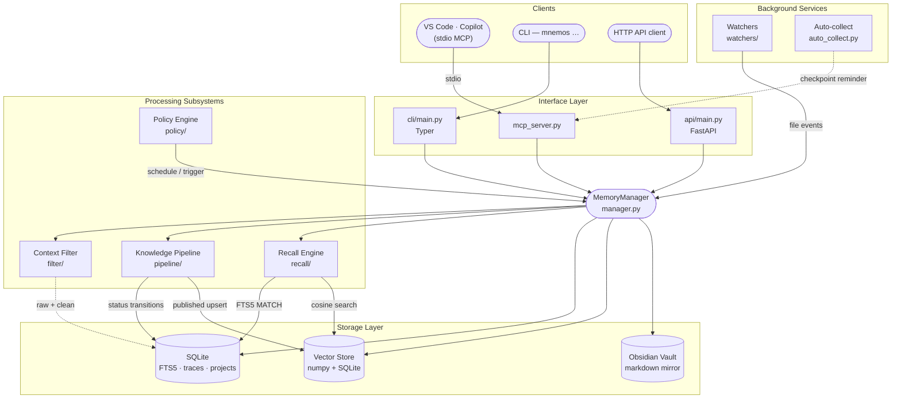
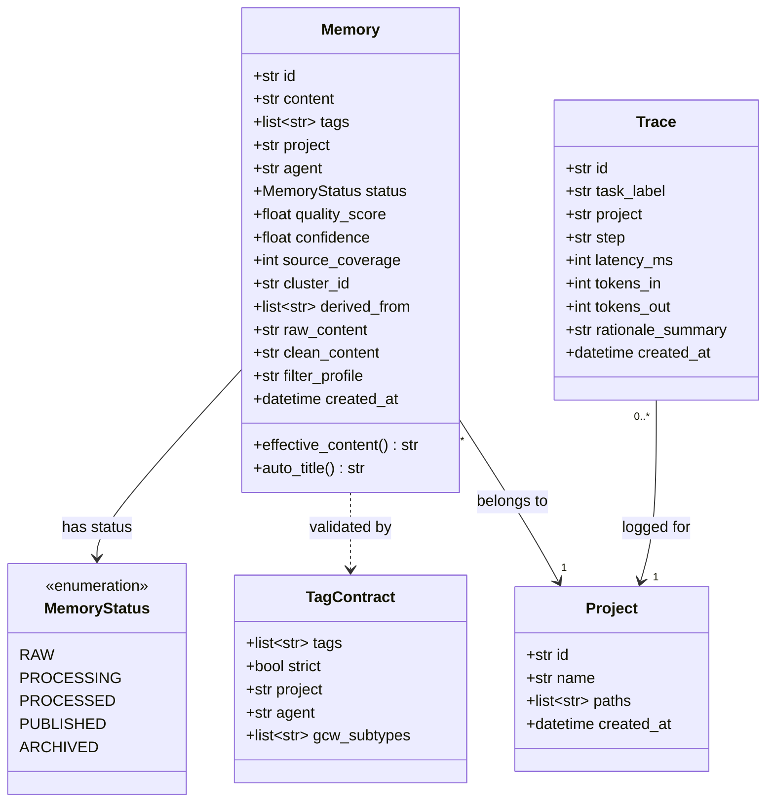
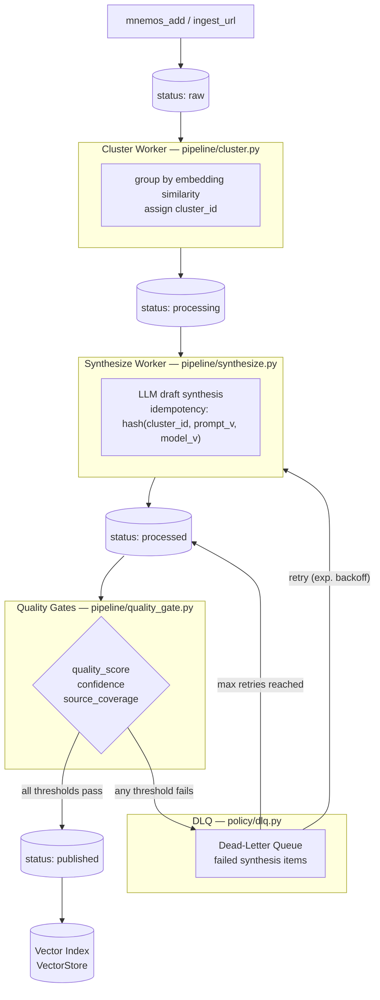
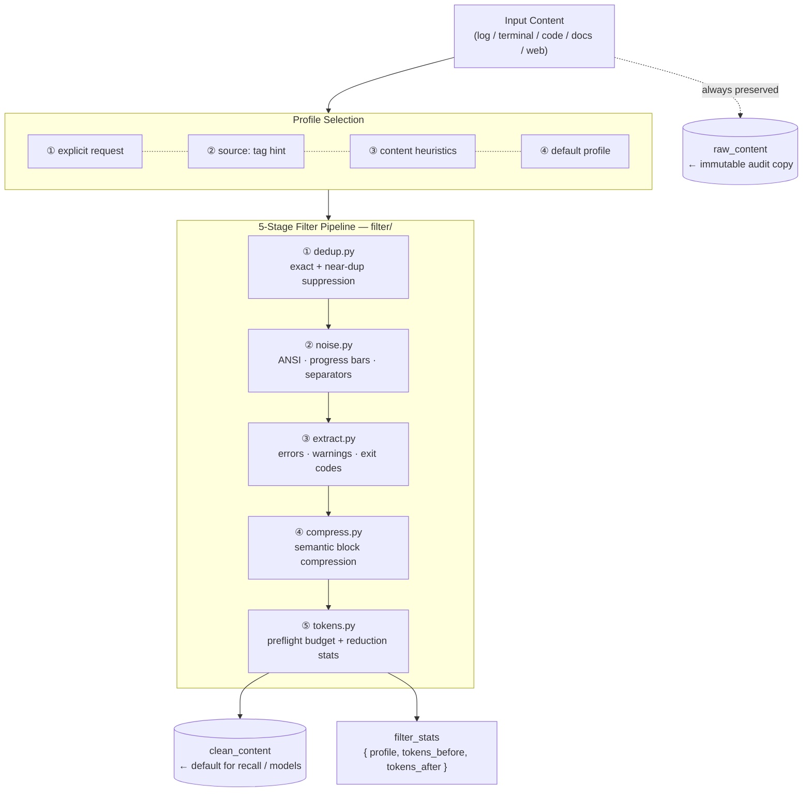
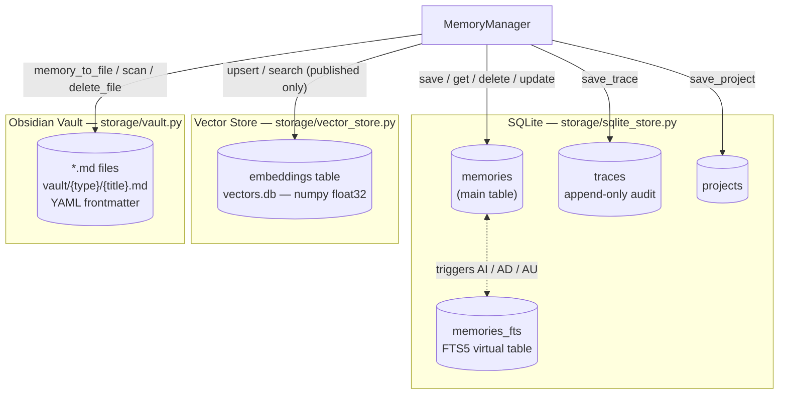
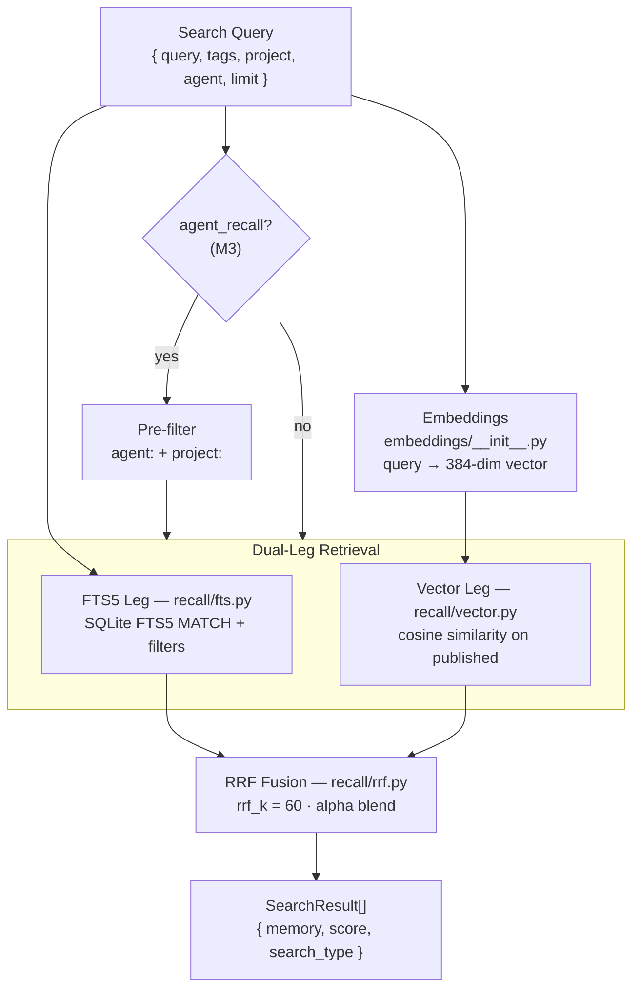
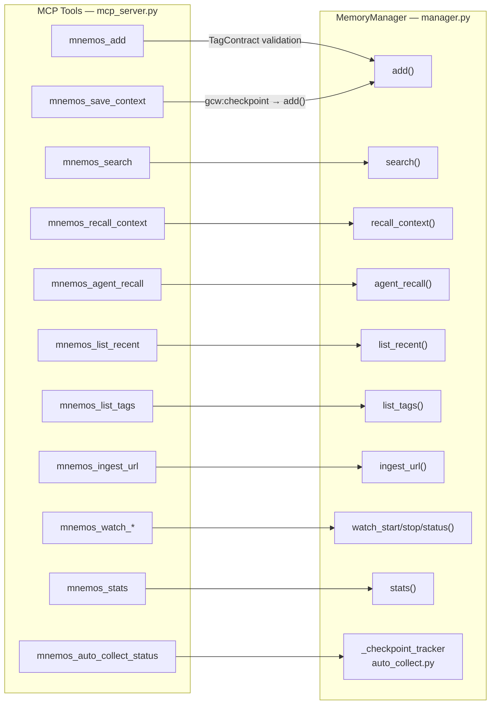
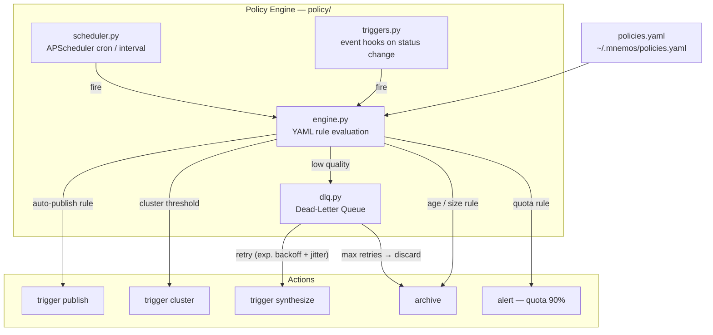
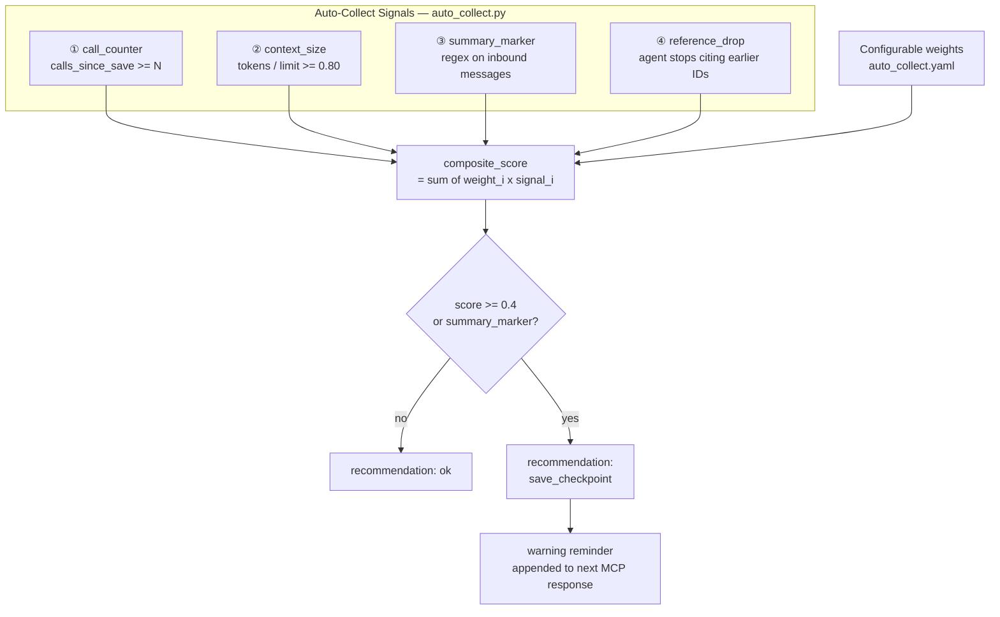

# Mnemos — architecture

> Companion to [PLAN.md](PLAN.md). PLAN is the *how* (phases, tasks, ordering). ARCHITECTURE is the *what* (components, interfaces, data, decisions).

## 1. System overview

Mnemos is a single-tenant memory/knowledge service for AI agents (primarily Copilot agents in VS Code, via MCP). It is forked from `ai-brain` and retains its core stack:

- **Runtime**: Python 3.11+, FastAPI HTTP API, Typer CLI, MCP server (stdio + optional SSE).
- **Storage**: SQLite (FTS5) for raw + processing + processed, ChromaDB (vector) only for `published` knowledge units, Obsidian-compatible vault on disk for human-readable mirror.
- **Embeddings**: local ONNX (MiniLM-class) — privacy + offline.
- **Packaging**: rootless `podman` container; systemd quadlet units; user-level install option.

### Conceptual layers



## 2. Core data model

### `Memory` (single unified table, status-driven)

| field | type | notes |
|---|---|---|
| `id` | uuid | primary key |
| `content` | text | markdown body |
| `tags` | array<string> | validated by `TagContract` |
| `project` | string | denormalised from `project:*` tag |
| `agent` | string | denormalised from `agent:*` tag |
| `status` | enum | `raw \| processing \| processed \| published` |
| `quality_score` | float? | populated by synthesis / quality-gate |
| `confidence` | float? | populated by synthesis |
| `source_coverage` | int? | distinct source URLs / paths in cluster |
| `cluster_id` | string? | set during clustering |
| `derived_from` | array<uuid> | provenance for `processed`/`published` |
| `embedding_id` | string? | ChromaDB id when published |
| `raw_content` | text? | immutable source payload (logs/stdout/html/etc.) |
| `clean_content` | text? | filtered projection used for recall/model input |
| `filter_profile` | string? | `log|terminal|code|docs|web|default` |
| `filter_stats` | json? | token + dedup reduction stats |
| `filter_version` | string? | filter pipeline version used for this record |
| `created_at` | datetime | |
| `updated_at` | datetime | |

### `TagContract`

Required composition for any `mnemos_add`:
- exactly one `project:<slug>` tag
- exactly one `agent:<slug>` tag (or `agent:user` for human-authored)
- ≥1 tag from `gcw:*` namespace (`gcw:session`, `gcw:bug-pattern`, `gcw:learning`, `gcw:decision`, `gcw:rule`, `gcw:open-question`, `gcw:checkpoint`, `gcw:legacy`)
- Optional whitelisted prefixes: `severity:`, `stack:`, `applyTo:`, `source:`

Enforcement: at MCP layer when `strict_tag_contract=true` (default for new installs). Lax mode tags legacy records `gcw:legacy` + `agent:unknown` automatically.

### `Trace`

Per-pipeline-step audit row (M6):
`task_label, project, step, item_id, llm_called, llm_done, cache_hit, fallback_used, latency_ms, tokens_in/out, tokens_per_sec, rationale_summary (≤200 chars, NO chain-of-thought)`.

### Data model diagram



## 3. Interfaces

### MCP tools (stable names — the GCW stub plugin already references these)

| tool | purpose |
|---|---|
| `mnemos_add` | write a memory (validated by TagContract) |
| `mnemos_search` | hybrid search (FTS + vector + RRF) over `published` |
| `mnemos_recall_context` | session-init: most recent N for a project |
| `mnemos_agent_recall` | filter by `agent:` (+ optional project / query) — **new in Mnemos** |
| `mnemos_save_context` | checkpoint-style write with auto-tagged `gcw:checkpoint` |
| `mnemos_list_recent` | recency-ordered listing |
| `mnemos_list_tags` | tag directory |
| `mnemos_ingest_url` | URL ingest → raw |
| `mnemos_watch_start/stop/status` | vault watcher control |
| `mnemos_auto_collect_status` | compaction-signal report |
| `mnemos_stats` | health + counters |

### HTTP API

Mirrors MCP tools (`POST /memories`, `GET /recall/...`, `GET /search`, etc.) plus pipeline endpoints `POST /process`, `POST /synthesize`, `POST /publish`, `GET /memories?status=`, `GET /traces`, `GET /metrics`.

### CLI

`mnemos add`, `mnemos search`, `mnemos recall --agent <x>`, `mnemos cluster`, `mnemos synthesize`, `mnemos publish`, `mnemos tags validate`, `mnemos migrate-from-ai-brain`, `mnemos dlq list/retry/discard`, `mnemos watch --include-rules`.

## 4. Knowledge pipeline (M4) — the core architectural addition



**Key invariant**: only `status="published"` ever lives in the vector index. This is what makes hybrid recall high-signal: noise is filtered upstream by quality gates, not by ranking heuristics.

## 4a. Context Filter (M10) — pre-LLM token-noise reduction

Context Filter sits between interface input and downstream pipeline/recall so the model receives concise, semantically complete context instead of raw noise.

### Invariant

- Filtering never destroys data.
- `raw_content` is always retained for audit/drill-down.
- `clean_content` is the default payload for retrieval and model-facing flows.

### Pipeline

1. **Dedup** (`dedup.py`) — exact + near-duplicate suppression.
2. **Noise strip** (`noise.py`) — ANSI escape removal, progress bars, repeated separators, timestamp prefixes.
3. **Signal extract** (`extract.py`) — keep errors/warnings/exit-status + informative slices for large outputs.
4. **Compress** (`compress.py`) — semantic compression for repetitive blocks.
5. **Token estimate** (`tokens.py`) — preflight token budgeting and reduction accounting.

### Profiles

Configured in `~/.mnemos/filter_profiles.yaml`:

- `log`
- `terminal`
- `code`
- `docs`
- `web`
- `default`

Selection priority: explicit request → `source:` tag hint → content heuristics → `default`.

### API behavior

- `mnemos_add`: optional `filter_profile`, stores both raw and clean forms.
- recall/search tools return `clean_content` by default.
- `include_raw=true` enables drill-down to source payload.

## 5. Policy engine (M5)

Declarative YAML rules (`~/.mnemos/policies.yaml`):
- Auto-publish thresholds (quality + confidence + source-coverage).
- Defer / archive rules based on age, status, cluster size.
- Per-project overrides.

Reliability primitives:
- **Idempotency** — synthesis is keyed on `hash(cluster_id, prompt_version, model_version)`. Repeats return cached result. This is also the v1 stand-in for the deferred Cache Center.
- **DLQ** — failed synthesis lives here; manual `mnemos dlq retry/discard`.
- **Retry** — exponential backoff with jitter; capped attempts.

## 6. Recall & ranking

- **FTS5**: SQLite full-text index over `content` + `tags`.
- **Vector**: ChromaDB on `published` only.
- **Fusion**: Reciprocal Rank Fusion (RRF) of the two result lists.
- **Per-agent recall** (M3): pre-filter by `agent:<slug>` (+ optional `project:<slug>`) before search; index covers `(tag_value, project_value)`.
- **File-context boost** (M8): when a `current_file_path` is provided, rules with matching `applyTo:` glob are pinned to the top.
- **Filtered output default** (M10): recall returns `clean_content` unless `include_raw=true` is explicitly requested.

## 7. Compaction detection (M7)

Auto-collect signals (weighted, configurable in `~/.mnemos/auto_collect.yaml`):
1. **Call counter** (inherited from ai-brain): N calls in T seconds → suggest checkpoint.
2. **Context-size heuristic**: client-reported token estimate > 80 % of model limit.
3. **Summary-marker detection**: regex on the most recent inbound messages for `<conversation-summary>` / `<compacted>`.
4. **Reference-drop heuristic**: agent stops citing earlier identifiers in the last N tool calls.

`mnemos_auto_collect_status` returns the per-signal vector + composite recommendation.

## 8. Path-scoped rules ingest (M8)

File watcher on `.github/instructions/*.instructions.md` in configured repos. On change:
- Parse frontmatter (`applyTo:` glob).
- Create / update a `Memory` with `status=published`, tags `gcw:rule`, `project:<repo>`, `applyTo:<glob>`, `source:path-scoped-rule`.
- On delete → remove memory + vector entry.

This makes path-scoped rules first-class searchable knowledge instead of inert instruction files.

## 9. Security & operational posture

- **Rootless podman** by default. MCP server bound to localhost / unix-socket; HTTP API loopback only unless explicitly bound.
- **Secrets**: provider API keys via env vars (`MNEMOS_ANTHROPIC_API_KEY`, …) read once at startup; never written to logs.
- **URL ingest sanitisation**: strip credentials from URLs before storing.
- **Explainability**: only short `rationale_summary` (≤200 chars), never raw LLM chain-of-thought.
- **Filter safety**: Context Filter never removes source data; raw payload remains retrievable for audit/debug.
- **Quotas**: per-project soft cap on raw count; alert at 90 %.
- **Audit**: `traces` table is append-only.

## 10. Migration & deprecation

- `mnemos migrate-from-ai-brain` (M13): SQLite + vault import; lax tag mode for legacy data; backup first; dry-run flag.
- ai-brain (M14): README header marks it `DEPRECATED`; tag `final-v0.2.x`; main branch frozen.

## 11. Module layout (Python)

> **Note**: Uses `src/` layout (inherited from ai-brain) to keep the Python package off `sys.path` by default and prevent accidental shadowing.

```
pyproject.toml
src/
  mnemos/
    __init__.py
    config.py            # env + YAML config
    models.py            # Memory, TagContract, Trace, Cluster
    manager.py           # MemoryManager — CRUD + search orchestrator
    storage/
      __init__.py
      sqlite_store.py    # SQLite FTS5 + pipeline state
      vector_store.py    # ChromaDB (published-only)
      vault.py           # Obsidian markdown mirror
    llm/
      __init__.py
      base.py            # provider abstraction
      anthropic.py
      openai.py
      azure_openai.py
      ollama.py
      gemini.py
    embeddings/
      __init__.py
      onnx_local.py      # local ONNX MiniLM (privacy + offline)
    pipeline/
      __init__.py
      cluster.py
      synthesize.py
      quality_gate.py
      publish.py
    policy/
      __init__.py
      scheduler.py
      triggers.py
      engine.py          # YAML rule evaluation
      dlq.py
    filter/
      __init__.py
      dedup.py
      noise.py
      extract.py
      compress.py
      tokens.py
    recall/
      __init__.py
      fts.py
      vector.py
      rrf.py
      agent_recall.py
    watchers/
      __init__.py
      vault.py
      path_scoped.py
    traces.py            # explainability layer
    auto_collect.py      # compaction signals
    mcp_server.py
    api/
      __init__.py
      main.py            # FastAPI
      routes/
    cli/
      __init__.py
      main.py            # Typer
      migrate.py
docs/
  tag-contract.md
  pipeline.md
  policies.md
  runbooks/
tests/
  __init__.py
  test_tag_contract.py
  test_agent_recall.py
  test_pipeline.py
  test_policy_engine.py
  test_traces.py
  test_compaction_detection.py
  test_path_scoped_rules.py
  test_migration.py
  test_recall.py
  test_filter.py
  ...
```

### M1 Git bootstrap commands (run once in mnemos/ dir)

```bash
# Step 1: clone ai-brain history into a temp directory
git clone /var/home/abyss/LABs/AI/ai-brain /tmp/mnemos-bootstrap

# Step 2: copy planning docs into temp clone
cp README.md PLAN.md ARCHITECTURE.md /tmp/mnemos-bootstrap/

# Step 3: copy .git from temp clone into mnemos/
cp -r /tmp/mnemos-bootstrap/.git .

# Step 4: rename origin → upstream-ai-brain (read-only reference)
git remote rename origin upstream-ai-brain
git remote set-url --push upstream-ai-brain DISABLED  # prevent accidental push

# Step 5: stage all changes and commit the fork baseline
git add -A
git commit -m "chore(m1): fork from ai-brain; add Mnemos planning documents"

# Step 6: (optional) set a new origin when you have a Mnemos repo
# git remote add origin <your-mnemos-remote-url>
```

## 12. Out of scope for v1 (explicit)

- **Cache Center** (M11) — deferred to v2.
- **New Web UI from scratch** — if ai-brain has one, we extend; if not, Swagger + mkdocs only.
- **Multi-tenant / multi-user auth** — Mnemos is single-tenant by design.
- **Cloud-managed embeddings** — local ONNX only.
- **Cross-machine sync** — out of scope; v2 if demanded.

## 13. Open questions for the implementation session

1. Confirm local ONNX embeddings (recommendation: keep).
2. Final list of LLM providers for synthesis at launch (current set: Anthropic + OpenAI + Azure OpenAI + Ollama + Gemini).
3. mcp.json server-name aliasing policy.
4. Git strategy verification: `git clone` + remote-rename approach OK?

## 14. Component diagrams

### Context Filter pipeline



### Storage layer



### Hybrid recall engine



### MCP tools → MemoryManager



### Policy engine



### Compaction detection signals (M7)



## 15. References

- ai-brain repo: `/var/home/abyss/LABs/AI/ai-brain/`
- ai-brain knowledge-pipeline concept: `ai-brain/docs/knowledge-pipeline-concept.md` (v0.4 roadmap)
- GCW stub plugin: `GithubCopilotWorkflow/plugins/mnemos-integration/`
- GCW tag contract skill: `GithubCopilotWorkflow/skills/mnemos-tag-contract/SKILL.md`
