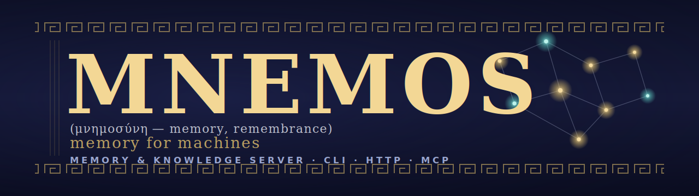

<!-- markdownlint-disable MD041 MD033 -->
<p align="center">
  
</p>

<h1 align="center">Mnemos</h1>

<p align="center">
  <strong>A memory &amp; knowledge server for AI agents</strong><br>
  <em>named after the Titaness of memory, built for the GCW agent family</em>
</p>

<p align="center">
  <a href="https://github.com/Korrnals/mnemos/actions/workflows/ci.yml"></a>
  <a href="pyproject.toml"></a>
  <a href="pyproject.toml"></a>
  <a href="CHANGELOG.md"></a>
</p>

<p align="center">
  <strong>🇬🇧 English</strong> · <a href="README.ru.md">🇷🇺 Русский</a>
</p>

<p align="center">
  <a href="#-quick-start">Quick start</a> ·
  <a href="#-what-mnemos-is">What it is</a> ·
  <a href="#%EF%B8%8F-architecture">Architecture</a> ·
  <a href="#%EF%B8%8F-three-surfaces-one-core">Surfaces</a> ·
  <a href="#-documentation">Docs</a>
</p>

---

## 🚀 Quick start

Four steps to a working memory store, wired into VS Code Copilot.

### 1 · Install

```bash
curl -fsSL https://raw.githubusercontent.com/Korrnals/mnemos/main/scripts/install.sh | bash
```

The installer does everything for you — no Python or venv knowledge required:

- creates an isolated environment at `~/.mnemos-venv`;
- drops a `mnemos` launcher into `~/.local/bin`, so the CLI just works in any shell (**no venv activation needed**);
- offers to wire up VS Code MCP integration right there (or run it later — see step 3).

> Prefer a non-interactive run? Add `--mcp` / `--no-mcp` to decide up front, e.g.
> `… | bash -s -- --mcp`.

### 2 · Write &amp; recall

```bash
mnemos add "First memory — Mnemos remembers across sessions" \
  --tags project:mnemos,agent:tech-writer,gcw:learning

mnemos search "remembers across sessions"
```

That's the whole loop: **write, find, never lose it.** Every entry carries a
[tag contract](docs/en/user/tag-contract.md) (`project:` / `agent:` / `gcw:`) so memories stay organised.

### 3 · Connect VS Code (MCP)

If you answered **yes** during install, you're already done — just reload your VS Code window.
To set it up manually, or on another machine:

```bash
curl -fsSL https://raw.githubusercontent.com/Korrnals/mnemos/main/scripts/mcp-setup.sh | bash
```

Then **reload the VS Code window** (`Ctrl+Shift+P → Reload Window`). The `mnemos_*` tools appear in
Copilot's tool picker, and your agents can call `mnemos_add` / `mnemos_search` directly.

### 4 · Deploy behavioral instructions

```bash
mnemos integration setup
```

This deploys memory-usage instructions, skills, and a prompt mode to your
agent harness (GCW `~/.copilot/`, generic Copilot, Cursor). Agents will now
*know when and how* to use Mnemos memory — not just have the tools available.

<details>
<summary><strong>🛠️ Other ways to install</strong> — from source, released wheel, or container one-liner</summary>

<br>

**From source** (for development):

```bash
git clone https://github.com/Korrnals/mnemos.git
cd mnemos
uv venv && source .venv/bin/activate
uv pip install -e ".[dev]"
```

**Released wheel** (pin a specific version):

```bash
pip install https://github.com/Korrnals/mnemos/releases/download/v1.1.3/mnemos-1.1.3-py3-none-any.whl
```

**Container one-liner** — pulls the image, creates volumes, starts on port 8787:

```bash
export MNEMOS_API__TOTP_MASTER_KEY=$(python3 -c "import secrets; print(secrets.token_urlsafe(32))")
curl -fsSL https://raw.githubusercontent.com/Korrnals/mnemos/main/scripts/install.sh | bash -s -- --container
```

See the full [container deployment guide](docs/en/admin/runbooks/container-deployment.md).

</details>

<details>
<summary><strong>🐳 Run the pre-built image directly (GHCR)</strong></summary>

<br>

Published to `ghcr.io/korrnals/mnemos` on every release tag.

```bash
# Generate a TOTP master key (required — the container binds 0.0.0.0)
export MNEMOS_API__TOTP_MASTER_KEY=$(python3 -c "import secrets; print(secrets.token_urlsafe(32))")

podman run -d --name mnemos \
  -p 8787:8787 \
  -v mnemos-data:/data \
  -v mnemos-vault:/vault \
  -e MNEMOS_API__TOTP_MASTER_KEY="${MNEMOS_API__TOTP_MASTER_KEY}" \
  ghcr.io/korrnals/mnemos:1.2.0

curl -s http://localhost:8787/health | jq
```

Tags: `:1.2.0` (pinned) · `:latest` (rolling). Works with `docker` too — swap `podman` for `docker`.

</details>

> 📘 For a guided first run covering the MCP and HTTP servers, see
> [getting-started.md](docs/en/user/getting-started.md).

---

## 🧩 What Mnemos is

A **single-tenant, local-first memory server** for AI agents. One in-process core, three equivalent
control surfaces, and a storage layer you can read with your own eyes.

|  | Capability | What it gives you |
|---|------------|-------------------|
| 🔎 | **Hybrid search** | Vector similarity + SQLite FTS5 full-text over every memory |
| 🧪 | **Knowledge pipeline** | `raw → processing → processed → published` lifecycle with a state machine |
| 🧠 | **Per-agent recall** | A focused recall surface scoped to each agent's project context |
| ⚙️ | **Policy engine** | Schedule and trigger automation over the memory store |
| 🧹 | **Context filter** | Five-stage noise stripper for logs / stdout before anything hits a model |
| 📂 | **Path-scoped rules** | Ingest project rules and apply them by file path |
| 🗂️ | **Obsidian vault** | A markdown mirror humans can browse, edit, and grep |

SQLite for metadata, a local numpy + SQLite vector index for recall, and an Obsidian-compatible vault
for the humans in the loop.

---

## 🏗️ Architecture

<details open>
<summary><strong>System diagram</strong> — clients → interfaces → core → storage</summary>

<br>


</details>

A deeper walkthrough — data model, state machines, security boundaries, operational concerns — lives in
[architecture/overview.md](docs/en/architecture/overview.md).

---

## 🎛️ Three surfaces, one core

The same `MemoryManager` powers all three interfaces. Pick the one that fits your client.

| Surface | Use it when… | Reference |
|---------|--------------|-----------|
| **CLI** — `mnemos …` | You live in a shell, want fast ad-hoc add / search, or are scripting cron jobs | [cli-reference.md](docs/en/user/cli-reference.md) |
| **HTTP** — `mnemos serve` | You have a non-MCP client — a web dashboard, a mobile app, a CI runner | [http-api.md](docs/en/user/http-api.md) |
| **MCP** — `mnemos mcp-server` | You are VS Code Copilot or any MCP-aware agent — the path the GCW family takes | [mcp-tools.md](docs/en/user/mcp-tools.md) |

The MCP surface also exposes the **A2A Sessions API** (M16) — a persistent backend for multi-step agent
conversations. Five endpoints (`POST /v1/sessions`, append-turn, range-load, …) let GCW survive restarts
without losing context. See [a2a-sessions.md](docs/en/architecture/a2a-sessions.md).

---

## 📖 The lore

> In Hesiod's *Theogony*, **Mnemosyne** (Μνημοσύνη) is the Titaness of memory — she who, by Zeus, gave
> birth to the nine Muses and through them made the world's remembering possible. Her name is the root of
> *mnemonic*, and she is what every singer, poet, and philosopher prays to before they begin.

This software carries her name because it is built for the same task: **to make remembering possible for
the things that think.** AI agents, unmoored from any single conversation, lose everything that came
before. Mnemos gives them a place to lay it down — structured, searchable, governed by contract — so that
what they learn does not vanish with the closing of a session. The Muses, after all, were not for the
gods' benefit. They were for the songs.

---

## 📚 Documentation

| Page | What it covers |
|------|----------------|
| [docs/README.md](docs/README.md) | Documentation landing — language picker (EN / RU) |
| [getting-started.md](docs/en/user/getting-started.md) | First run: install → first memory → first search → MCP / HTTP |
| [architecture/overview.md](docs/en/architecture/overview.md) | System shape, data model, state machines, security boundaries |
| [cli-reference.md](docs/en/user/cli-reference.md) | Every `mnemos` subcommand with flags, defaults, examples |
| [mcp-tools.md](docs/en/user/mcp-tools.md) | Every `mnemos_*` tool exposed to VS Code Copilot |
| [http-api.md](docs/en/user/http-api.md) | Every HTTP endpoint (memory CRUD + A2A Sessions, M16) |
| [a2a-sessions.md](docs/en/architecture/a2a-sessions.md) | Agent-to-agent conversation contract (M16) |
| [tag-contract.md](docs/en/user/tag-contract.md) | The `project:` / `agent:` / `gcw:` schema enforced on every memory |
| [security.md](docs/en/admin/security.md) | Threat model, SSRF guard, FTS5 escape, HF Hub pinning |
| [runbooks/](docs/en/admin/runbooks/) | Install, migrate, backup / restore, dependency updates |
| [container-deployment.md](docs/en/admin/runbooks/container-deployment.md) | Build, push, compose, podman, Kubernetes, quadlet |
| [adr/](docs/project/adr/) | Architectural decision records — the *why* behind the design |
| [milestones.md](docs/project/milestones.md) | Milestone ledger with status legend |
| [CHANGELOG.md](CHANGELOG.md) | Release notes — Keep a Changelog format |

---

## 🤝 Relationship to the GCW agent family

Mnemos is the standalone backing store for the **GCW (GitHub Copilot Workflow)** senior-agent team. The
GCW repo ships a thin stub plugin (`plugins/mnemos-integration`) that runs in a degraded file-mode until
Mnemos is reachable; once the MCP server is up, the stub transparently switches to `mnemos_*` tools
without code changes. The shared contract is the [tag schema](docs/en/user/tag-contract.md) —
`project:<slug>`, `agent:<slug>`, and at least one `gcw:<subtype>` — that every memory entry must carry.

---

## ⚖️ Source &amp; license

- **Source** — this repository, [github.com/Korrnals/mnemos](https://github.com/Korrnals/mnemos).
- **License** — MIT (see [pyproject.toml](pyproject.toml)).

## 🌱 Contributing

PRs welcome. Read [PLAN.md](PLAN.md) for the roadmap and follow the conventions in the [docs/](docs/) set.

Git workflow: `feat/*` → `dev-<stage>` → `release/X.Y.Z` → `main`; `main` accepts only `release/*` and
`hotfix/*` PRs. Conventional Commits required. Run `make verify` before opening a PR.

---

<p align="center">
  <sub><strong>Reproduce the green state:</strong> <code>make verify</code> runs the full quality gate
  — ruff + mypy --strict + bandit + pip-audit + 209 tests. If it's green, the change is good to ship.</sub>
</p>
