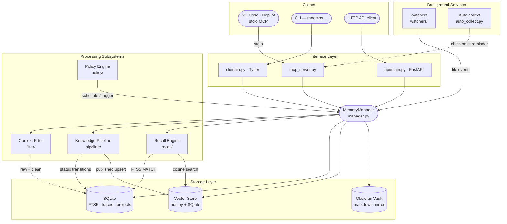

<!-- markdownlint-disable MD041 -->
<p align="center">
  
</p>

<p align="center">
  <strong>🇬🇧 English</strong> · <a href="README.ru.md">🇷🇺 Русский</a>
</p>

# Mnemos

> **A memory &amp; knowledge server for AI agents** — named after the Titaness, built for the GCW agent family.

[](https://github.com/Korrnals/mnemos/actions/workflows/ci.yml) [](pyproject.toml) [](pyproject.toml) [](CHANGELOG.md)

---

## The lore

In Hesiod's *Theogony*, **Mnemosyne** (Μνημοσύνη) is the Titaness of memory — she who, by Zeus, gave birth to the nine Muses and through them made the world's remembering possible. Her name is the root of *mnemonic*, and she is what every singer, poet, and philosopher prays to before they begin.

This software carries her name because it is built for the same task: **to make remembering possible for the things that think**. AI agents, unmoored from any single conversation, lose everything that came before. Mnemos gives them a place to lay it down — structured, searchable, governed by contract — so that what they learn does not vanish with the closing of a session. The Muses, after all, were not for the gods' benefit. They were for the songs.

## What Mnemos is

A single-tenant, local-first memory server. Hybrid search (vector + full-text) over a knowledge pipeline (`raw → processing → processed → published`), a per-agent recall surface, a policy engine for automation, an explainability layer, path-scoped rules ingest, and a five-stage context filter that strips the noise from logs and stdout before anything is sent to a model. Three equivalent control surfaces — CLI, HTTP, MCP — over a single in-process core. SQLite for metadata, a local vector index for recall, an Obsidian-compatible vault for humans.

## How it fits together



A more thorough walkthrough — data model, state machines, security boundaries, operational concerns — lives in [docs/en/architecture/overview.md](docs/en/architecture/overview.md).

## Quick start

```bash
git clone https://github.com/Korrnals/mnemos.git
cd mnemos
uv venv && source .venv/bin/activate
uv pip install -e ".[dev]"
mnemos add --content "First memory — use uv, not pip" \
           --tags project:mnemos agent:tech-writer gcw:learning
mnemos search "uv vs pip" --limit 5
```

That's the whole loop: install, write, find. For a step-by-step first run including the MCP and HTTP servers, see [docs/en/user/getting-started.md](docs/en/user/getting-started.md).

> **Install options.** The repo install above is the fastest for development.
> Mnemos 1.1.3 is also available as a [released wheel](https://github.com/Korrnals/mnemos/releases/download/v1.1.3/mnemos-1.1.3-py3-none-any.whl) (`pip install <url>`) and as a [container image](https://ghcr.io/korrnals/mnemos) (`ghcr.io/korrnals/mnemos:1.1.3`) — see [docs/en/admin/runbooks/container-deployment.md](docs/en/admin/runbooks/container-deployment.md).

### One-liner install

```bash
curl -fsSL https://raw.githubusercontent.com/Korrnals/mnemos/main/scripts/install.sh | bash
```

Creates a venv at `~/.mnemos-venv`, installs the latest wheel with `[mcp]` extra, and verifies the `mnemos` CLI. Options: `--version 1.1.3`, `--extra mcp,ollama`, `--venv ~/custom`, `--no-venv`.

**Container one-liner:**

```bash
export MNEMOS_API__TOTP_MASTER_KEY=$(python3 -c "import secrets; print(secrets.token_urlsafe(32))")
curl -fsSL https://raw.githubusercontent.com/Korrnals/mnemos/main/scripts/install.sh | bash -s -- --container
```

Pulls `ghcr.io/korrnals/mnemos:latest`, creates volumes, and starts the container on port 8787. See [container-deployment.md](docs/en/admin/runbooks/container-deployment.md) for full details.

### Container (pre-built image from GHCR)

The image is published to `ghcr.io/korrnals/mnemos` on every release tag. Pull and run directly:

```bash
# Generate a TOTP master key (required — container binds 0.0.0.0)
export MNEMOS_API__TOTP_MASTER_KEY=$(python3 -c "import secrets; print(secrets.token_urlsafe(32))")

# Pull and run
podman run -d --name mnemos \
  -p 8787:8787 \
  -v mnemos-data:/data \
  -v mnemos-vault:/vault \
  -e MNEMOS_API__TOTP_MASTER_KEY="${MNEMOS_API__TOTP_MASTER_KEY}" \
  ghcr.io/korrnals/mnemos:1.1.3

# Verify
curl -s http://localhost:8787/health | jq
```

Tags: `ghcr.io/korrnals/mnemos:1.1.3` (pinned), `ghcr.io/korrnals/mnemos:latest` (rolling). Works with `docker` too — replace `podman` with `docker`. Full guide: [container-deployment.md](docs/en/admin/runbooks/container-deployment.md).

## Three surfaces, one core

The same MemoryManager powers all three interfaces — pick the one that fits the client.

| Surface | Use it when… | Reference |
|---------|--------------|-----------|
| **CLI** — `mnemos …` | You live in a shell, want fast ad-hoc add/search, or are scripting cron jobs | [docs/en/user/cli-reference.md](docs/en/user/cli-reference.md) |
| **HTTP** — `mnemos serve` | You have a non-MCP client (a web dashboard, a mobile app, a CI runner) | [docs/en/user/http-api.md](docs/en/user/http-api.md) |
| **MCP** — `mnemos mcp-server` | You are VS Code Copilot or any MCP-aware agent; this is the path the GCW family takes | [docs/en/user/mcp-tools.md](docs/en/user/mcp-tools.md) |

The MCP surface also exposes the **A2A Sessions API** (M16) — a persistent backend for multi-step agent conversations. Five endpoints (`POST /v1/sessions`, append-turn, range-load, …) so GCW can survive restarts without losing context. See [docs/en/architecture/a2a-sessions.md](docs/en/architecture/a2a-sessions.md).

## Documentation

| Page | What it covers |
|------|----------------|
| [docs/README.md](docs/README.md) | Documentation landing — language picker (EN / RU) |
| [docs/en/user/getting-started.md](docs/en/user/getting-started.md) | First run: install → first memory → first search → MCP / HTTP |
| [docs/en/architecture/overview.md](docs/en/architecture/overview.md) | System shape, data model, state machines, security boundaries |
| [docs/en/user/cli-reference.md](docs/en/user/cli-reference.md) | Every `mnemos` subcommand with flags, defaults, examples |
| [docs/en/user/mcp-tools.md](docs/en/user/mcp-tools.md) | Every `mnemos_*` tool exposed to VS Code Copilot |
| [docs/en/user/http-api.md](docs/en/user/http-api.md) | Every HTTP endpoint (memory CRUD + A2A Sessions, M16) |
| [docs/en/architecture/a2a-sessions.md](docs/en/architecture/a2a-sessions.md) | Agent-to-agent conversation contract (M16) |
| [docs/en/user/tag-contract.md](docs/en/user/tag-contract.md) | The `project:` / `agent:` / `gcw:` schema enforced on every memory |
| [docs/en/admin/security.md](docs/en/admin/security.md) | Threat model, SSRF guard, FTS5 escape, HF Hub pinning |
| [docs/en/admin/runbooks/](docs/en/admin/runbooks/) | Install, migrate, backup / restore, dependency updates |
| [docs/en/admin/runbooks/container-deployment.md](docs/en/admin/runbooks/container-deployment.md) | Build, push, compose, podman, Kubernetes, quadlet — full container deploy guide |
| [docs/project/adr/](docs/project/adr/) | Architectural decision records — the *why* behind the design choices |
| [docs/project/milestones.md](docs/project/milestones.md) | Milestone ledger with status legend |
| [CHANGELOG.md](CHANGELOG.md) | Release notes — Keep a Changelog format |

## Relationship to the GCW agent family

Mnemos is the standalone backing store for the **GCW (GitHub Copilot Workflow)** senior-agent team. The GCW repo ships a thin stub plugin (`plugins/mnemos-integration`) that runs in a degraded file-mode until Mnemos is reachable; once the MCP server is up, the stub transparently switches to `mnemos_*` tools without code changes. The shared contract is the [tag schema](docs/en/user/tag-contract.md) — `project:<slug>`, `agent:<slug>`, and at least one `gcw:<subtype>` — that every memory entry must carry.

## Source, upstream, license

- **Source**: this repository, [github.com/Korrnals/mnemos](https://github.com/Korrnals/mnemos).
- **License**: MIT (see [pyproject.toml](pyproject.toml)).

## Contributing

PRs welcome. Read [PLAN.md](PLAN.md) for the current roadmap and follow the conventions in the [docs/](docs/) set. Run `make verify` before opening a PR.

The Git workflow for this repo: `feat/*` → `dev-<stage>` → `release/X.Y.Z` → `main`; `main` accepts only `release/*` and `hotfix/*` PRs. Conventional Commits required.

---

> **Reproduce the green state**: `make verify` runs the full quality gate (ruff + mypy --strict + bandit + pip-audit + 209 tests). If it is green, the change is good to ship.
