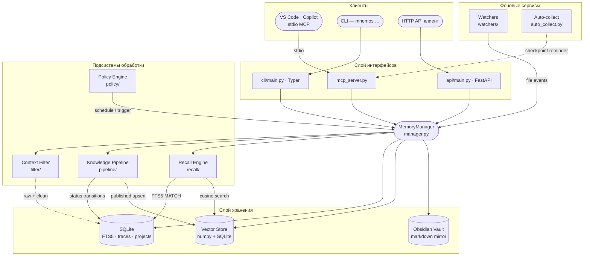

<!-- markdownlint-disable MD041 MD033 -->
<p align="center">
  
</p>

<h1 align="center">Mnemos</h1>

<p align="center">
  <strong>Сервер памяти и знаний для AI-агентов</strong><br>
  <em>назван в честь титаниды памяти, создан для семейства агентов GCW</em>
</p>

<p align="center">
  <a href="https://github.com/Korrnals/mnemos/actions/workflows/ci.yml"></a>
  <a href="pyproject.toml"></a>
  <a href="pyproject.toml"></a>
  <a href="https://github.com/Korrnals/mnemos/releases"></a>
</p>

<p align="center">
  <a href="README.md">🇬🇧 English</a> · <strong>🇷🇺 Русский</strong>
</p>

<p align="center">
  <a href="#-быстрый-старт">Быстрый старт</a> ·
  <a href="#-что-такое-mnemos">Что это</a> ·
  <a href="#%EF%B8%8F-архитектура">Архитектура</a> ·
  <a href="#%EF%B8%8F-три-поверхности-одно-ядро">Поверхности</a> ·
  <a href="#-документация">Документация</a>
</p>

---

## 🚀 Быстрый старт

Четыре шага до рабочего хранилища памяти, подключённого к VS Code Copilot.

### 1 · Установка

```bash
curl -fsSL https://raw.githubusercontent.com/Korrnals/mnemos/main/scripts/install.sh | bash
```

Установщик делает всё за вас — знание Python или venv не требуется:

- создаёт изолированное окружение в `~/.mnemos/venv`;
- кладёт лаунчер `mnemos` в `~/.local/bin`, чтобы CLI работал в любом шелле (**активировать venv не нужно**);
- тут же предлагает настроить интеграцию VS Code MCP (или сделайте это позже — см. шаг 3).

> Нужен неинтерактивный запуск? Добавьте `--mcp` / `--no-mcp`, чтобы выбрать заранее, например
> `… | bash -s -- --mcp`.

### 2 · Запись и поиск

```bash
mnemos add "Первая запись — Mnemos помнит между сессиями" \
  --tags project:mnemos,agent:tech-writer,gcw:learning

mnemos search "помнит между сессиями"
```

Это весь цикл: **записал, нашёл, не потерял.** Каждая запись несёт
[контракт тегов](docs/ru/user/tag-contract.md) (`project:` / `agent:` / `gcw:`), чтобы память оставалась упорядоченной.

### 3 · Подключение к VS Code (MCP)

Если во время установки вы ответили **да** — всё готово, просто перезагрузите окно VS Code.
Чтобы настроить вручную или на другой машине:

```bash
curl -fsSL https://raw.githubusercontent.com/Korrnals/mnemos/main/scripts/mcp-setup.sh | bash
```

Затем **перезагрузите окно VS Code** (`Ctrl+Shift+P → Reload Window`). Инструменты `mnemos_*` появятся
в палитре инструментов Copilot, и агенты смогут вызывать `mnemos_add` / `mnemos_search` напрямую.

### 4 · Установка поведенческих инструкций

```bash
mnemos integration setup
```

Развёртывает инструкции использования памяти, скилы и режим промпта в ваш
агентский харнес (GCW `~/.copilot/`, обычный Copilot, Cursor). Агенты теперь
*знают когда и как* использовать память Mnemos — а не просто имеют инструменты.

Добавьте `--wire-agents --all`, чтобы в том же проходе выдать инструменты
`mnemos/*` во фронтматтер GCW-агентов. См. [руководство по интеграции](docs/ru/user/integration-guide.md#подключение-mcp-инструментов-к-агентам)
по флагам wiring и [руководство по контекстному фильтру](docs/ru/user/context-filter.md)
— пятиступенчатый очиститель шума, который запускается автоматически при каждом `mnemos_add`.

<details>
<summary><strong>🛠️ Другие способы установки</strong> — из исходников, готовый wheel или контейнер</summary>

<br>

**Из исходников** (для разработки):

```bash
git clone https://github.com/Korrnals/mnemos.git
cd mnemos
uv venv && source .venv/bin/activate
uv pip install -e ".[dev]"
```

**Готовый wheel** (зафиксировать конкретную версию):

<!-- version:pip -->
```bash
pip install https://github.com/Korrnals/mnemos/releases/download/v2.7.4/mnemos-2.7.4-py3-none-any.whl
```
<!-- /version:pip -->

**Контейнер одной командой** — скачивает образ, создаёт тома, запускает на порту 8787:

```bash
export MNEMOS_API__TOTP_MASTER_KEY=$(python3 -c "import secrets; print(secrets.token_urlsafe(32))")
curl -fsSL https://raw.githubusercontent.com/Korrnals/mnemos/main/scripts/install.sh | bash -s -- --container
```

Полное руководство — [container-deployment.md](docs/ru/admin/runbooks/container-deployment.md).

</details>

<details>
<summary><strong>🐳 Запуск готового образа напрямую (GHCR)</strong></summary>

<br>

Образ публикуется в `ghcr.io/korrnals/mnemos` при каждом release-теге.

```bash
# Сгенерируйте TOTP-ключ (обязательно — контейнер слушает 0.0.0.0)
export MNEMOS_API__TOTP_MASTER_KEY=$(python3 -c "import secrets; print(secrets.token_urlsafe(32))")

podman run -d --name mnemos \
  -p 8787:8787 \
  -v mnemos-data:/data \
  -v mnemos-vault:/vault \
  -e MNEMOS_API__TOTP_MASTER_KEY="${MNEMOS_API__TOTP_MASTER_KEY}" \
<!-- version:image -->
  ghcr.io/korrnals/mnemos:2.7.4
<!-- /version:image -->

curl -s http://localhost:8787/health | jq
```

<!-- version:tags -->
Теги: `:2.7.4` (фиксированная) · `:latest` (rolling). Работает и с `docker` — замените `podman` на `docker`.
<!-- /version:tags -->

</details>

> 📘 Пошаговое руководство первого запуска с MCP- и HTTP-серверами —
> [getting-started.md](docs/ru/user/getting-started.md).

---

## 🧩 Что такое Mnemos

**Однотенантный, локально-ориентированный сервер памяти** для AI-агентов. Одно ядро in-process, три
эквивалентных поверхности управления и слой хранения, который можно прочитать своими глазами.

|  | Возможность | Что это даёт |
|---|------------|-------------------|
| 🔎 | **Гибридный поиск** | Векторная близость + полнотекстовый FTS5 по каждой записи |
| 🧪 | **Конвейер знаний** | Жизненный цикл `raw → processing → processed → published` с конечным автоматом |
| 🧠 | **Recall на агента** | Сфокусированная поверхность recall в контексте проекта каждого агента |
| ⚙️ | **Движок политик** | Планирование и триггеры автоматизации над хранилищем памяти |
| 🧹 | **Контекстный фильтр** | Пятиступенчатая очистка логов / stdout перед отправкой модели |
| �️ | **Обратимое сжатие (CCR)** | Сжатие большого контента без потери данных — оригиналы кэшируются в SQLite, извлекаются по хеш-маркеру |
| �📂 | **Path-scoped rules** | Ингест правил проекта и применение их по пути файла |
| 🗂️ | **Obsidian vault** | Markdown-зеркало, которое люди могут смотреть, править и grep'ать |

SQLite для метаданных, локальный векторный индекс на numpy + SQLite для recall и Obsidian-совместимый
vault для людей в процессе.

---

## 🏗️ Архитектура

<details open>
<summary><strong>Схема системы</strong> — клиенты → интерфейсы → ядро → хранилище</summary>

<br>



</details>

Более глубокий разбор — модель данных, конечные автоматы, границы безопасности, эксплуатационные аспекты —
в [architecture/overview.md](docs/ru/architecture/overview.md).

---

## 🎛️ Три поверхности, одно ядро

Один и тот же `MemoryManager` управляет всеми тремя интерфейсами. Выберите подходящий клиенту.

| Поверхность | Когда использовать… | Документация |
|---------|--------------|-----------|
| **CLI** — `mnemos …` | Вы работаете в шелле, нужен быстрый ad-hoc add / search или скрипты cron | [cli-reference.md](docs/ru/user/cli-reference.md) |
| **HTTP** — `mnemos serve` | У вас не-MCP клиент — веб-дашборд, мобильное приложение, CI runner | [http-api.md](docs/ru/user/http-api.md) |
| **MCP** — `mnemos mcp-server` | Вы VS Code Copilot или любой MCP-aware агент — путь семейства GCW | [mcp-tools.md](docs/ru/user/mcp-tools.md) |

MCP-поверхность также предоставляет **A2A Sessions API** (M16) — постоянный бэкенд для многошаговых
разговоров агентов. Пять endpoints (`POST /v1/sessions`, append-turn, range-load, …) позволяют GCW
переживать рестарты без потери контекста. См. [a2a-sessions.md](docs/ru/architecture/a2a-sessions.md).

---

## 📖 Лор

> В «Теогонии» Гесиода **Мнемосина** (Μνημοσύνη) — титанида памяти. Она, от Зевса, родила девять муз и
> через них сделала возможным воспоминание мира. Её имя — корень слова *мнемонический*, и к ней обращается
> каждый певец, поэт и философ, прежде чем начать.

Это программное обеспечение носит её имя, потому что создано для той же задачи: **сделать воспоминание
возможным для тех, кто мыслит.** AI-агенты, оторванные от единственного разговора, теряют всё, что было
до. Mnemos даёт им место, где можно это сохранить — структурированно, с поиском, по контракту — чтобы то,
что они узнали, не исчезало с закрытием сессии. Музы, в конце концов, были не для богов. Они были для
песен.

---

## 📚 Документация

| Страница | Содержание |
|------|----------------|
| [docs/README.md](docs/README.md) | Главная страница документации — выбор языка (EN / RU) |
| [getting-started.md](docs/ru/user/getting-started.md) | Первый запуск: установка → первая запись → первый поиск → MCP / HTTP |
| [architecture/overview.md](docs/ru/architecture/overview.md) | Архитектура, модель данных, конечные автоматы, границы безопасности |
| [cli-reference.md](docs/ru/user/cli-reference.md) | Все подкоманды `mnemos` с флагами, значениями по умолчанию, примерами |
| [mcp-tools.md](docs/ru/user/mcp-tools.md) | Все инструменты `mnemos_*` для VS Code Copilot |
| [http-api.md](docs/ru/user/http-api.md) | Все HTTP endpoints (CRUD памяти + A2A Sessions, M16) |
| [a2a-sessions.md](docs/ru/architecture/a2a-sessions.md) | Контракт agent-to-agent разговоров (M16) |
| [tag-contract.md](docs/ru/user/tag-contract.md) | Схема `project:` / `agent:` / `gcw:`, обязательная для каждой записи |
| [security.md](docs/ru/admin/security.md) | Модель угроз, SSRF-защита, FTS5 escape, пиннинг HF Hub |
| [runbooks/](docs/ru/admin/runbooks/) | Установка, миграция, резервное копирование, обновление зависимостей |
| [container-deployment.md](docs/ru/admin/runbooks/container-deployment.md) | Сборка, push, compose, podman, Kubernetes, quadlet |
| [adr/](docs/project/adr/) | Архитектурные решения (ADR) — *почему* за каждым дизайном |
| [milestones.md](docs/project/milestones.md) | Журнал milestones со статусами |
| [CHANGELOG.md](CHANGELOG.md) | Release notes — формат Keep a Changelog |

---

## 🤝 Связь с семейством агентов GCW

Mnemos — автономное хранилище для senior-agent команды **GCW (GitHub Copilot Workflow)**. Репозиторий GCW
содержит тонкий stub-плагин (`plugins/mnemos-integration`), который работает в деградированном файловом
режиме, пока Mnemos недоступен; как только MCP-сервер поднят, stub прозрачно переключается на `mnemos_*`
инструменты без изменения кода. Общий контракт — [схема тегов](docs/ru/user/tag-contract.md) —
`project:<slug>`, `agent:<slug>` и хотя бы один `gcw:<subtype>` — которую должна нести каждая запись.

---

## ⚖️ Исходный код и лицензия

- **Исходник** — этот репозиторий, [github.com/Korrnals/mnemos](https://github.com/Korrnals/mnemos).
- **Лицензия** — MIT (см. [pyproject.toml](pyproject.toml)).

## 🌱 Участие

PR приветствуются. Прочитайте [PLAN.md](PLAN.md) для roadmap и следуйте конвенциям в [docs/](docs/).

Git-workflow: `feat/*` → `dev-<этап>` → `release/X.Y.Z` → `main`; `main` принимает только `release/*` и
`hotfix/*` PR. Обязательны Conventional Commits. Запустите `make verify` перед открытием PR.

---

<p align="center">
  <sub><strong>Воспроизведите зелёное состояние:</strong> <code>make verify</code> запускает полный
  quality gate — ruff + mypy --strict + bandit + pip-audit + 802 тестов. Если зелёно — готово к публикации.</sub>
</p>