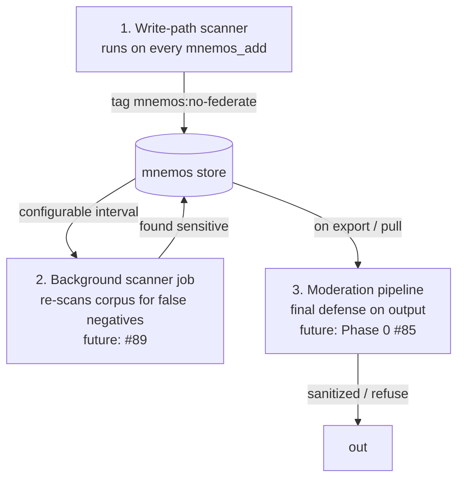

# Mnemos — Security Posture (M15.2)

**🌐 Language / Язык:** English · [Русский](../../ru/admin/security.md)

> **Owner**: Mnemos Security Engineer
> **Status**: Active — last reviewed 2026-06-15
> **Scope**: Mnemos memory & knowledge server (forked from ai-brain)
> **Out of scope**: M16 A2A Sessions API (new module, separate threat model)

This document captures the security-relevant design decisions of the Mnemos
codebase. It is the authoritative reference when triaging findings, writing
new tests, or reviewing pull requests that touch trust boundaries.

---

## 1. Threat model summary

Mnemos is a **local-first, single-tenant, file-backed** memory server
deployed as either a CLI tool, a stdio MCP server, or a loopback HTTP API
(defaults to `127.0.0.1`). It exposes:

- A SQLite database (`mnemos.db`) and an Obsidian-compatible vault.
- A local FastAPI HTTP API (default `127.0.0.1:8787`).
- An MCP server over stdio.
- Optional outbound network calls to LLM providers (Ollama / OpenAI / etc.)
  and to user-supplied URLs (`ingest_url`).

### Trust boundaries

| Boundary | Trust side | Untrusted side | Mitigations |
|----------|------------|----------------|-------------|
| `ingest_url` (HTTP fetch) | Mnemos process | Public Internet (any URL the user passes) | SSRF blocklist — see §2 |
| HF Hub download (`ONNXHubProvider`) | Mnemos process | HuggingFace Hub | Pinned `revision=` (CWE-494) — see §3 |
| MCP stdio | Mnemos process | Local AI agent | Unix permission boundary, no auth needed (loopback) |
| FastAPI HTTP API | Mnemos process | Local processes (loopback) | Loopback bind by default; no remote surface in v1 |
| FTS5 search (`fts_search`) | Mnemos process | End-user query string | FTS5 escape — see §4 |
| `update_fields` dynamic SQL | Mnemos process | `**kwargs` from callers | Whitelisted column dispatch — see §5 |
| `0.0.0.0` listener string | Mnemos process | bandit B104 (false positive) | `# nosec B104` with justification — see §6 |

### Out of scope for v1

- Multi-tenant auth (only single-tenant / single-user deployments).
- TLS / mutual auth (loopback-only surface in v1).
- Vault-at-rest encryption (deferred to a post-M15 hardening phase).
- Rate limiting on MCP endpoints (deferred).

---

## 2. SSRF prevention (`MemoryManager._validate_url`)

The `ingest_url` method can fetch any URL the user supplies. Without
controls, an attacker can pivot through Mnemos to reach loopback or
cloud-metadata endpoints.

**Blocklist** (must stay current — see advisory list below):

- Schemes: only `http`, `https` accepted (rejects `file:`, `gopher:`, etc.).
- Hostnames: `localhost`, `127.0.0.1`, `0.0.0.0`, `::1`,
  `169.254.169.254` (AWS / GCP / Azure metadata).
- CIDR ranges: `127.0.0.0/8`, `10.0.0.0/8`, `172.16.0.0/12`,
  `192.168.0.0/16`.

**Followed redirects?** Yes, with a hard cap of 5 hops (v2 posture, T5-SSRF).
Redirects are followed **manually** with `httpx.Client(follow_redirects=False)`.
Every `Location` target is passed through `_validate_url` before the next
request is issued (per-hop guard). This closes the open-redirect pivot where
a public host returns 30x to an internal or metadata endpoint that would
otherwise bypass the initial URL check. Exceeding the hop limit or a loop
detection results in a fetch-failed placeholder (no exception surfaces to
the caller).

**Tests**: `tests/test_security.py::TestUrlValidation`. Includes
`169.254.169.254` (AWS metadata) and the full RFC1918 ranges.

**SSRF guard v2 additions (integration/backend-mvp)**: regression tests now
cover obfuscated-IP encodings — decimal (`2130706433`), octal (`0177.0.0.1`),
and hex (`0x7f000001`) representations of loopback, and the same encoding
classes for `169.254.169.254` (metadata). A `user@host` userinfo component in
the URL (which can mask the real host in some parsers) is also covered. The
guard resolves hosts via `getaddrinfo` before applying the blocklist, so all
encoding variants are normalised to real IPs before the check runs.
See `tests/test_ssrf_redirect.py`.

---

## 3. Supply chain — HF Hub pinning (M15.2, B615)

`ONNXHubProvider` downloads ONNX model files from HuggingFace Hub.
Without `revision=`, every call pulls the latest commit on the default
branch — a compromised or replaced model would be picked up silently.
This is **CWE-494** (download of code without integrity check).

**Mitigations (defence in depth)**:

1. **Pinned revision (primary)** — `EmbeddingConfig.hf_revision` defaults
   to a specific commit SHA. Every `hf_hub_download` call must pass
   `revision=` (the code path in `ONNXHubProvider.__init__` raises
   `ValueError` if the operator does not provide one).
2. **Configurable** — the SHA can be overridden via
   `MNEMOS_EMBEDDING__HF_REVISION` env var or `config.yaml`. Operators
   changing `embedding.model` MUST also update `embedding.hf_revision`
   to a matching pinned SHA.
3. **SHA256 verification (planned, not yet implemented)** — TODO for a
   follow-up phase. The HF Hub response should be hashed and compared
   against an expected digest stored alongside the pinned revision.

**Tests**: `tests/test_security.py::TestHfHubPinning` mocks
`huggingface_hub.hf_hub_download` and asserts `revision=` is in the
kwargs of every call.

---

## 4. FTS5 injection prevention (M15.2, B608)

`SQLiteStore.fts_search` runs `MATCH` against user-supplied query text.
FTS5 has a rich query syntax (`*`, `NEAR`, column filters via `:`)
that turns naive interpolation into a powerful injection vector:
e.g. `'" OR col:"content'; DROP TABLE memories; --'` would not execute
the DROP (FTS5 is read-only), but would cause data exfiltration or
errors that leak schema information.

**Mitigation** — `_build_fts_query`:

1. Strip FTS5 special characters: `* " ' ( ) :`.
2. Collapse whitespace.
3. Wrap the result in double quotes — FTS5 treats the contents of a
   double-quoted string as a literal phrase with **no operator parsing**.

The fix is documented in the SQLite reference:
<https://www.sqlite.org/fts5.html#fts5_strings>.

The SQL body itself is now built by concatenating static fragments and
`?` placeholders, so no user input flows into the statement.

**Tests**: `tests/test_security.py::TestFts5Escaping` feeds hostile
strings (`" OR col:"content`, `'"; DROP TABLE ...`, etc.) and asserts
the query returns no rows and does not raise.

---

## 5. Dynamic SQL — whitelisted column dispatch (M15.2, B608)

`SQLiteStore.update_fields` previously built the `UPDATE` statement with
an f-string of the form `f"UPDATE memories SET {setters} WHERE id=?"`,
where `setters` was filtered at runtime by an `allowed` set. Bandit
B608 flags this because static analysis cannot prove the filter is
exhaustive. A future maintainer widening `allowed` carelessly would
re-introduce the vulnerability.

**Mitigation** — module-level `_FIELD_UPDATERS` dict:

- Keys are the **only** column names `update_fields` will ever accept.
- Values are pre-baked SQL fragments (`"status=?"`, `"title=?"`, …).
- The `UPDATE` is built by joining the **dict values** (static strings),
  never user-supplied identifiers. Values are bound `?` parameters.

Adding a new column requires editing the dict AND the SQLite schema —
the two cannot drift silently.

**Tests**: `tests/test_security.py::TestSqlInjectionSafe::test_update_fields_rejects_unknown_columns`
and `...test_update_fields_no_fstring_injection` ensure malicious kwargs
are silently dropped and the table is never corrupted.

---

## 6. Network binding — `0.0.0.0` (M15.2, B104)

Bandit B104 flags the string literal `"0.0.0.0"` anywhere in code, on
the assumption that it is a socket bind. In Mnemos the string appears
**only inside an SSRF blocklist** (`MemoryManager._validate_url`) — it
is the *thing being rejected*, not a bind target. The actual API server
(`cli/main.py:serve`) defaults to `127.0.0.1`; an operator who
deliberately wants container port-mapping can pass `--host 0.0.0.0`,
and that path is also documented.

**Suppression** (per `lint-and-validate.instructions.md` — "When
suppression is acceptable"):

- `manager.py:379`: `# nosec B104 — blocklist entry, not a bind()`

This is a **confirmed false positive** of the bandit rule, annotated
with a one-line explanation at the suppression site. The same pattern
is used in `cli/main.py` if and when the operator passes `--host
0.0.0.0`.

---

## 7. Other controls already in place

These were introduced in earlier M-phases and are listed here for
completeness — they are **not** part of M15.2.

- **Path traversal** — `VaultManager._sanitize_filename` replaces `/`
  and `..` segments in vault filenames. `path_scoped.py` uses
  `Path.resolve()` to keep watchers inside the watched root.
- **M2 tag contract** — `models.py::validate_tag_contract` enforces
  the `project:` / `agent:` / `mnemos:` prefix taxonomy at the MCP layer.
- **M9 SSRF guard** — `_validate_url` (covered in §2).
- **M6 traces** — every LLM-bound step is recorded with latency, token
  counts, and a `rationale_summary`. This is the audit log; no separate
  log infrastructure required for v1.

---

## 8. Verification

Run before merging any change that touches code, configuration, or
schema:

```bash
bandit -r src/                  # MUST: 0 issues (no skips)
pytest tests/test_security.py -v
pytest tests/ -q
ruff check src/ tests/          # MUST: 0 errors
```

If a new finding is intentionally suppressed, follow the suppression
contract from `.copilot/instructions/lint-and-validate.instructions.md`:

1. Confirm it is a false positive of the tool, not of the code.
2. One-line comment next to the suppression with the rule id and reason.
3. Scope limited to one line / one statement / one function.

---

## 9. Authentication, session management, and TOTP 2FA (T-AUTH, ADR-0014)

> **Status**: Implemented in `integration/backend-mvp`. Gated by
> `api.auth_enabled` (default `false`). Not active on default loopback
> deployments unless explicitly enabled.

### 9.1 Token model

Mnemos uses **opaque bearer tokens** (prefix `mnk_`, 256-bit random via
`secrets.token_urlsafe(32)`). Only the PBKDF2-HMAC-SHA256 digest of each
token is written to disk or SQLite (600 000 iterations, fixed salt
`mnemos.api.auth.fernet.v1`). The plaintext is shown once at creation and
never stored. A stolen `~/.mnemos/auth.db` or config file yields only the
hash, not a usable bearer string.

### 9.2 TOTP second factor

Per-token TOTP secrets are encrypted at rest with AES-128 (Fernet) using a
key derived from `api.totp_master_key`. The master key is **env-only**
(`MNEMOS_API__TOTP_MASTER_KEY`) and is never written to disk. An empty
master key is rejected at startup with a `ValueError` when
`api.totp_enabled=true`.

**Replay prevention**: a `totp_last_step` column on each token row records the
time-step (30-second window index) of the last accepted TOTP code. A new code
is rejected unless its time-step strictly exceeds the recorded value — a
captured code cannot be replayed even within its validity window.

**`totp_required` flag (v2.7.6+)**: each token has a `totp_required` boolean:
- `totp_required=true` (default) — operator token for human access. Requires
  full login → TOTP verify → session flow.
- `totp_required=false` — API token for machine-to-machine (M2M) access. The
  bearer token is accepted directly by the middleware, skipping session
  validation. Created via `mnemos auth token create --no-totp`.

This enables clean separation of human and machine auth without TOTP code
reuse issues. The middleware checks: `mnk_`-prefixed tokens with
`totp_required=0` → direct access; all others → session validation required.

### 9.3 Session lifecycle

- Sessions are issued as a second opaque token after successful login (and
  TOTP verification when enabled). TTL is `api.session_ttl_sec`
  (default 8 h, range 300–86400 s).
- Optional IP pinning (`api.session_pin_ip=true`): the session is bound to
  the IP seen at creation; requests from a different IP receive 401.
- `X-Forwarded-For` is used for IP keying **only** when the direct peer is
  inside a `trusted_proxies` CIDR. Arbitrary XFF headers from untrusted
  peers are ignored to prevent rate-limit bypass and IP-pinning evasion.
- Session cookies are `HttpOnly; Secure; SameSite=Strict`. The `Secure`
  flag is set when `api.behind_tls_proxy=true` or when
  `X-Forwarded-Proto: https` is present from a trusted proxy.

### 9.4 Middleware behaviour

`AuthMiddleware` runs after CORS (CORS is outermost) and before routes:

- Allows `/health`, `/auth/login`, `/auth/verify`, `/docs`, `/redoc`,
  `/openapi.json` without a session.
- **Fails closed**: if the API config object is absent (misconfigured
  startup), returns HTTP 503 `{"detail": "Auth not initialised"}` for every
  protected route instead of silently allowing through.
- Loopback bypass: if `api.auth_enabled=false` and the request originates
  from `127.0.0.1` or `::1`, requests pass through. Non-loopback clients
  receive 401 even when `auth_enabled=false` (defense-in-depth against
  future bind misconfiguration).

### 9.5 CLI startup guard

`mnemos serve` exports `MNEMOS_API__HOST` and `MNEMOS_API__PORT` into the
environment before launching uvicorn. The worker's startup guard checks the
exported host: a non-loopback bind is refused with a non-zero exit unless
`api.auth_enabled=true`. This prevents a misconfigured "auth later" deploy
from silently opening the API to the network.

### 9.6 Tests

- `tests/test_auth.py` — token creation, hash storage, login happy path,
  TOTP enroll + verify, session lifecycle, logout.
- `tests/test_auth_security.py` — STRIDE T1–T12 coverage; key cases:
  non-loopback-bind refusal, CSRF / cookie-only rejection, TOTP brute-force
  lockout, replay-after-revoke, master-key requirement.

See ADR-0014 for the full threat model.

---

## 10. Stream M — security posture improvements

> **Status**: In progress (2026-06-20). This section documents the
> posture improvements landing in the Stream M hardening pass. Items
> marked **planned** are being fixed in parallel with this documentation;
> items marked **done** are already in the codebase.

### 10.1 LLM API keys — `SecretStr` handling

LLM provider API keys (`openai_api_key`, `anthropic_api_key`,
`gemini_api_key`, `azure_api_key`) are moving to Pydantic `SecretStr`.
This prevents accidental leakage through:

- **Logging** — `SecretStr.__repr__` returns `SecretStr('**********')`,
  not the plaintext.
- **Serialization** — `model_dump()` returns the secret as
  `SecretStr('**********')`, not the raw value. Use
  `model_dump(mode="json", secrets=True)` only when the plaintext is
  explicitly needed.
- **Config dumps** — `mnemos doctor` and debug prints no longer expose
  keys.

**Recommended practice** — pass keys via environment variables, never
via `config.yaml` in VCS:

```bash
export MNEMOS_LLM__OPENAI_API_KEY="sk-..."
export MNEMOS_LLM__ANTHROPIC_API_KEY="sk-ant-..."
```

### 10.2 SSRF — blocked URLs rejected, not stored

When `ingest_url` fetches a URL that fails the SSRF blocklist (§2), the
URL is **rejected with an error** — it is never stored in memory. This
prevents a blocked endpoint from persisting as a memory entry that could
mislead a future recall. The fetch-failed placeholder records the
rejection reason, not the blocked URL itself.

### 10.3 `.gitignore` — secrets excluded

The `.gitignore` now excludes:

| Pattern | Reason |
|---------|--------|
| `config.yaml` | May contain API keys / tokens |
| `*.env` / `.env` | Environment files with secrets |
| `*.pem` / `*.key` | Private keys |
| `*.db` / `*.sqlite` | Local data (not for VCS) |
| `.history/` | VS Code local history cache |

Operators should keep secrets in environment variables or a secret
manager — never in committed config files.

### 10.4 Tag filtering — exact match via `json_each`

Tag filtering in `SQLiteStore.list_all` uses `tags LIKE '%"tag"%'` which
matches on the JSON string. This is an **exact tag match** — the
`%"tag"%` pattern ensures the tag is matched as a complete JSON string
element, not as a substring of another tag. For example, filtering by
`mnemos:decision` does not match `mnemos:decision-review`.

The `get_all_tags` aggregate uses `json_each(memories.tags)` to iterate
the JSON array directly — no string matching, no false positives.

### 10.5 Auth, CORS, and session controls (recap)

These controls are documented in §9 and remain in force:

- **Auth** — opaque bearer tokens (`mnk_` prefix), PBKDF2-HMAC-SHA256
  digests at rest, optional TOTP 2FA with replay prevention.
- **Session IP pinning** — `api.session_pin_ip=true` binds a session to
  the IP seen at creation.
- **CORS** — strict default (disabled). When enabled,
  `cors_allow_origins` must be an explicit list; combining `["*"]` with
  `cors_allow_credentials=true` is **rejected at startup**.

### 10.6 Verification

```bash
# Confirm no API keys in config dumps
mnemos doctor --json | grep -i api_key   # should show SecretStr('**********')

# Confirm SSRF rejection
mnemos add --url http://169.254.169.254/  # rejected, not stored

# Confirm .gitignore covers secrets
git check-ignore -v config.yaml .env     # should list .gitignore:line

# Confirm tag exact match
mnemos search --tags mnemos:decision         # does not match mnemos:decision-review
```

---

## 11. Federation defence-in-depth

Federation (batch sync + mediated pull) introduces a new trust boundary:
records that leave the local node can leak secrets that were never meant
to be shared. mnemos implements a **three-layer defence-in-depth**
(ArchCom 2026-07-17 federation contract §2.2.1) so that a single missed
layer does not expose a secret.



| Layer | Where | When | What it does | Status |
|-------|-------|------|-------------|--------|
| **1. Write-path scanner** | `mnemos_add` / `POST /memories` / `ingest_url` / `ingest_path_scoped_rules` | On every write | Runs `detect_secrets(content)`. If a secret is detected and the record does not already carry `mnemos:no-federate`, the tag is auto-added. Logs pattern names + counts only — never raw matched values. | ✅ Shipped (#86) |
| **2. Background scanner** | MCP server, background job | Configurable interval (`federation.no_federate_scan_interval_hours`, default 6h) | Re-scans the whole corpus for false negatives missed at write time. Re-uses `detect_secrets` unchanged (DRY — one source of truth for patterns). | 🔮 Future (#89) |
| **3. Moderation pipeline** | Export (Phase 0) / Pull (Phase 2) | On every export / pull | Final defense — runs moderation on output. Even if the `no-federate` tag is missing, the pipeline sanitizes the content. | 🔮 Future (Phase 0, #85) |

### 11.1 Secrets detector module

The detector lives in `src/mnemos/secrets_detector.py` and exposes a
**stable public API** consumed by all three layers:

- `detect_secrets(content: str) -> list[SecretFinding]` — scan content.
- `redact_content(content: str, findings: list[SecretFinding]) -> str` — replace each match with `<REDACTED:<pattern_name>>`.
- `findings_by_pattern(findings) -> dict[str, int]` — log-safe counts.

Patterns (compiled once at module load): AWS access keys, GitHub tokens
(`ghp_`/`gho_`/`ghu_`/`ghs_`/`ghr_`), Slack tokens (`xox[abprs]-`),
OpenAI/Anthropic keys (`sk-`), JWTs, PEM private key headers, database
connection strings, and high-entropy base64 spans (Shannon entropy
≥ 4.8 bits/char, length ≥ 32).

**Constraint:** `SecretFinding.matched_value` exists for programmatic
redaction only. Logging code MUST use `findings_by_pattern()` — raw
matched values never enter log records, chat output, or mnemos memory
content.

### 11.2 `mnemos:no-federate` tag

See [Tag Contract — `mnemos:no-federate`](../user/tag-contract.md#mnemosno-federate--federation-exclusion-marker)
for the tag's lifecycle (auto-add, idempotent, removal with confirmation,
re-detection guard). The tag is an **exclusion marker** in the
`mnemos:` subtype namespace — it is NOT a cognitive category.

### 11.3 Export redaction + exclusion

`mnemos export` (JSON format) applies the defence-in-depth at output time:

- **Exclusion:** records tagged `mnemos:no-federate` are excluded from
  the export entirely (contract КП-6: "запись исключается из export И pull").
- **Redaction:** for records that pass the filter, the content (and
  `raw_content` when present) is scanned with `detect_secrets`. Any
  detected secret is replaced with `<REDACTED:<pattern_name>>` so the
  export never ships a raw credential, even if the write-path scanner
  (Layer 1) missed it.
- The export payload carries a `redaction_summary` field with counts
  (`excluded_no_federate`, `redacted_records`, `patterns`) — never raw
  values.

### 11.4 Import validation

`mnemos import` validates every record before writing:

- **Content** — max 1 MiB chars (default), no control characters except
  `\n` / `\t`, valid UTF-8.
- **Tags** — reuses `validate_tag_contract` (strict); max 32 tags, max 128
  chars per tag.
- **Title** — max 256 chars, no control characters.
- **Schema drift** — fields not in the current `Memory` schema are
  rejected with a field-level error.
- **Prompt-injection patterns** — `[INST]`, `<|im_start|>`, `system:`,
  `</s>`, `ignore previous instructions` — logged at WARNING, NOT
  blocked (content may legitimately discuss injection).
- `--dry-run` returns a validation report without writing.
- On schema-drift / contract violation, the **whole batch is rejected**
  (no partial writes).
