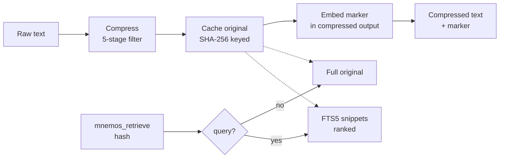

# Mnemos — System Architecture

**🌐 Language / Язык:** English · [Русский](../../ru/architecture/overview.md)

## Overview

Mnemos is a hybrid long-term memory system: a personal knowledge base and
RAG store for AI agents. Primary access surfaces: CLI, HTTP API, MCP server,
and an Obsidian-compatible vault. A Web UI is planned as a separate project
(mnemos-eyes).

## Core Principles

- **Markdown-first**: human-readable notes in Obsidian format (YAML frontmatter + markdown)
- **Semantic search**: vector embeddings over text data
- **Hybrid search**: full-text search + vector similarity, relevance-ranked results
- **Modularity**: core decoupled from interfaces; each interface is a thin adapter
- **Local-first**: everything works locally, no mandatory cloud dependencies
- **Extensibility**: plugin system for data sources and interfaces

---

## Architecture (Layers)

```
┌─────────────────────────────────────────────────────────┐
│                    INTERFACES                            │
│  ┌─────┐  ┌──────────────────────┐  ┌──────┐  ┌─────┐  │
│  │ CLI │  │  Web UI              │  │ API  │  │ MCP │  │
│  │Typer│  │  (planned,           │  │ REST │  │ Srv │  │
│  │     │  │   mnemos-eyes)       │  │      │  │     │  │
│  └──┬──┘  └──────────┬───────────┘  └──┬───┘  └──┬──┘  │
│     │               │               │          │       │
├─────┴───────────────┴───────────────┴──────────┴───────┤
│                    FastAPI (Core API)                    │
│            GET/POST /memories, /search, /ingest         │
├─────────────────────────────────────────────────────────┤
│                    CORE (brain_core)                     │
│  ┌──────────────┐ ┌──────────────┐ ┌──────────────────┐ │
│  │MemoryManager │ │ SearchEngine │ │IngestionPipeline │ │
│  │  CRUD ops    │ │ hybrid search│ │  parse & embed   │ │
│  └──────┬───────┘ └──────┬───────┘ └────────┬─────────┘ │
│         │                │                   │           │
├─────────┴────────────────┴───────────────────┴──────────┤
│                    STORAGE                               │
│  ┌────────────────┐  ┌───────────────┐  ┌─────────────┐ │
│  │ Obsidian Vault │  │  ChromaDB     │  │  SQLite     │ │
│  │ (markdown)     │  │  (vectors)    │  │  (metadata) │ │
│  └────────────────┘  └───────────────┘  └─────────────┘ │
├─────────────────────────────────────────────────────────┤
│                    EMBEDDING                             │
│  sentence-transformers (local) / Ollama / OpenAI API    │
└─────────────────────────────────────────────────────────┘
```

---

## Components

### 1. Storage Layer

| Component | Purpose | Technology |
| --- | --- | --- |
| Obsidian Vault | Human-readable notes, markdown + frontmatter | Filesystem |
| ChromaDB | Vector embeddings for semantic search | ChromaDB (persistent) |
| SQLite | Metadata, tags, relationships, history, cache | SQLite + aiosqlite |

**Obsidian compatibility**:
- Each "memory" is a markdown file with YAML frontmatter (tags, source, created, etc.)
- Supports `[[wiki-links]]` and `#tag` notation
- Vault directory is configurable
- File watcher monitors changes and re-indexes

### 2. Embedding Layer

- **Default**: `sentence-transformers/all-MiniLM-L6-v2` (fast, ~80 MB)
- **For Russian**: `intfloat/multilingual-e5-base` or `cointegrated/rubert-tiny2`
- **Optional**: Ollama embeddings, OpenAI API
- Embedding provider configured via config file
- Embedding caching to avoid repeated computation

### 3. Core (brain_core)

#### MemoryManager
- CRUD for memory entries (create, read, update, delete)
- Automatic embedding generation on create / update
- Sync: markdown file ↔ ChromaDB ↔ SQLite
- Tags, categories, priorities, TTL (entry lifetime)

#### SearchEngine
- **Semantic search**: vector similarity via ChromaDB
- **Full-text search**: FTS5 via SQLite
- **Hybrid search**: RRF (Reciprocal Rank Fusion) to combine results
- Filtering by tags, dates, sources, types

#### IngestionPipeline
- Parsing incoming data from different sources
- Chunking long documents (RecursiveCharacterTextSplitter)
- Deduplication (by content hash + cosine similarity)
- Automatic tag and metadata extraction

### Reversible Compression (CCR)

CCR (Compress-Cache-Retrieve) reduces the token cost of large content (tool output, logs, JSON) without losing data. It reuses the existing 5-stage context filter for compression and the existing SQLite store for caching — no separate database, no separate backup.

#### Pipeline



1. **Compress** — `apply_filter` runs the 5-stage pipeline (profile-aware: `log`, `terminal`, `code`, `docs`, `web`, `default`). Achieves 86–96% reduction on logs and JSON.
2. **Cache** — the original uncompressed text is stored in `ccr_cache` keyed by its SHA-256 hash. Content-addressed: re-compressing the same text is a no-op.
3. **Embed marker** — a short parseable marker is prepended to the compressed output:
   ```text
   [compressed: <hash> | <N>→<M> chars | retrieve via mnemos_retrieve]
   ```
4. **Retrieve** — `mnemos_retrieve(hash)` returns the full original (zero data loss). `mnemos_retrieve(hash, query=...)` returns FTS5-ranked snippets within the cached original.

#### Storage integration

The `ccr_cache` table lives in the same SQLite database as `memories`:

| Table | Purpose | Keyed by |
|-------|---------|----------|
| `ccr_cache` | Original uncompressed content | `hash` (SHA-256, PRIMARY KEY) |
| `ccr_cache_fts` | FTS5 external-content index over `ccr_cache.original` | `rowid` |

FTS5 is kept in sync via `AFTER INSERT/DELETE/UPDATE` triggers — no application-level sync code. Snippet retrieval uses the same FTS5 engine as memory search, scoped to a single cached original by `hash`.

#### Eviction

| Mechanism | Default | When it runs |
|-----------|---------|--------------|
| TTL expiry | 7 days | Explicit `ccr_cleanup()` (CLI / scheduler) |
| LRU eviction | 10000 entries | Opportunistic, on every `compress` call |

TTL cleanup is not run on every compress call (avoids the scan cost); invoke it via the CLI or a scheduler.

#### Configuration

```yaml
ccr:
  enabled: true            # master switch
  ttl_days: 7             # cache entry lifetime
  max_entries: 10000      # LRU eviction threshold
  min_size_chars: 500     # below this, content is returned as-is
  snippet_count: 5        # snippets returned by retrieve(query=...)
  filter_budget: 4096     # token budget passed to apply_filter
```

Content below `min_size_chars` is returned as-is with `cached=false` and `reduction_pct=0` — tiny content has no token savings.

---

### 4. Data Sources (Ingestors)

| Source | Method | Format |
| --- | --- | --- |
| Manual input | CLI / API | Text / Markdown |
| Obsidian vault | File watcher (watchdog) | Markdown + frontmatter |
| Web pages | URL → trafilatura/BeautifulSoup | HTML → clean text |
| Files | Upload via API | PDF, TXT, MD, DOCX |
| LLM chats | MCP / export | Dialogues |

### 5. Interfaces

#### CLI (Typer)
```bash
mnemos add "Note about something important" --tags project:mnemos agent:user gcw:learning   # quick add
mnemos add --file ./document.pdf --tags project:mnemos agent:user gcw:learning              # from a file
mnemos add --url https://example.com --tags project:research agent:user gcw:learning        # ingest a URL
mnemos search "how to configure nginx"             # hybrid search (FTS5 + vector + RRF)
mnemos search "CVE" --project mnemos --limit 20    # project-scoped search
mnemos recall --agent tech-writer --limit 20       # recent entries for an agent (M3)
mnemos stats                                       # store statistics
mnemos serve                                       # start the HTTP API
mnemos mcp-server                                  # start the MCP server (stdio)
```

#### REST API (FastAPI)
```
POST   /api/v1/memories          — create entry
GET    /api/v1/memories           — list (with pagination)
GET    /api/v1/memories/{id}      — get entry
PUT    /api/v1/memories/{id}      — update
DELETE /api/v1/memories/{id}      — delete
POST   /api/v1/search             — hybrid search
POST   /api/v1/ingest             — upload / parse
GET    /api/v1/tags               — list tags
POST   /api/v1/sync               — re-index
GET    /api/v1/health              — healthcheck
```

#### MCP Server
Tools for Copilot / LLM agents:
- `brain_search` — semantic search over memory
- `brain_add` — add a new entry
- `brain_get` — get entry by ID
- `brain_list_tags` — list tags
- `brain_ingest_url` — load a web page

#### Web UI (planned — mnemos-eyes)

A separate frontend project. Status: in development. Planned features:
- Dashboard: statistics, recent entries, tag cloud
- Search with filters
- Note editor

---

## Data Model

### Memory (entry)

```python
class Memory:
    id: str              # UUID
    content: str         # main text
    title: str | None    # title (auto or manual)
    tags: list[str]      # tags
    source: str          # source: manual, web, file, mcp, obsidian
    source_url: str | None
    memory_type: str     # note, fact, snippet, bookmark, conversation
    created_at: datetime
    updated_at: datetime
    embedding: list[float] | None
    metadata: dict       # additional data
    file_path: str | None  # path to markdown file in vault
```

### Markdown file (Obsidian)

```markdown
---
id: 550e8400-e29b-41d4-a716-446655440000
title: Configuring nginx reverse proxy
tags: [nginx, devops, linux]
source: web
source_url: https://example.com/nginx-guide
memory_type: note
created: 2026-04-10T12:00:00
updated: 2026-04-10T12:00:00
---

# Configuring nginx reverse proxy

Main note content...
```

---

## Configuration

```yaml
# config.yaml
mnemos:
  vault_path: ~/.mnemos/vault         # Obsidian vault
  data_dir: ~/.mnemos/data            # ChromaDB + SQLite

embedding:
  provider: sentence-transformers    # sentence-transformers | ollama | openai
  model: intfloat/multilingual-e5-base
  # ollama_url: http://localhost:11434
  # openai_api_key: ...

search:
  default_limit: 20
  hybrid_alpha: 0.7                  # semantic search weight (0=FTS, 1=vector)

api:
  host: 0.0.0.0
  port: 8787

mcp:
  transport: stdio                   # stdio | sse
```

---

## Roadmap

### Phase 1 — MVP ✦ (current)
- [x] Architecture and data models
- [ ] Core: MemoryManager + ChromaDB + SQLite
- [ ] Embedding layer (sentence-transformers)
- [ ] Hybrid search
- [ ] CLI (add, search, list, tags)
- [ ] Obsidian vault sync (read/write)
- [ ] REST API (FastAPI)

### Phase 2 — Integrations
- [ ] MCP server for Copilot
- [ ] Web scraping (ingest URLs)
- [ ] PDF/DOCX parsing

### Phase 3 — Advanced features
- [ ] Web UI (mnemos-eyes)
- [ ] Auto-categorisation (LLM-powered)
- [ ] Relationship graph between entries
- [ ] Auto-summarisation of long documents
- [ ] Periodic consolidation (merge similar entries)
- [ ] Export / Import

### Phase 4 — Scaling
- [ ] Migration to PostgreSQL + pgvector (optional)
- [ ] Multi-user support
- [ ] Storage encryption
