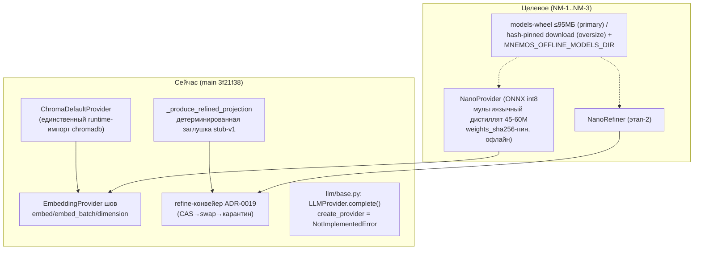

# Нано-модель памяти: архитектура, роадмап, чеклисты

Статус: план (TL-авторство, 2026-09-01). Основа: ADR-0021 (+амендмент Delivery 2026-08-31), решение комитета по компрессии (mnemos 4dad7946), NM-0 контур качества (в main, #206). Живой статус — docs/project/dev-plan.md; трекер — эпик #197.

## 1. Цель и рамка

Собственная сверхлёгкая модель для работы с памятью, живущая в пакете сервера: полная автономность без API-ключей и сети. Продуктовая рамка (ADR-0021): продаём **автономность**, не модель — «память без ключей и сети из коробки». Успех = «install → первый поиск без сети» на 100% свежих установок; каждая ступень проходит через коридоры бенчмарков (ADR-0020), не «на глаз».

Анти-скоуп (не строим): общий LLM (чат/кодогенерация/ответы), fine-tuning-инфраструктура для чужих задач, синхронный LM-путь, обучение в CI.

## 2. Архитектура (текущее состояние → целевое)

Швы готовности (проверено по коду):
- **Эмбеддер-шов чист**: интерфейс `EmbeddingProvider` (embed/embed_batch/dimension) + фабрика `create_embedding_provider`; `ONNXHubProvider` уже умеет onnxruntime+tokenizers+revision-пин (CWE-494/B615), mean-pooling+L2, CPU-потоки через `MNEMOS_ORT_THREADS`.
- **Refine-шов один**: `_produce_refined_projection` (pipeline/refine.py:129) — единственная точка замены; bump `REFINE_PROCESSING_VERSION` → `swap_key` меняется → корректный пере-свап.
- **LLM-фундамент уже написан** (открытие фактчека): на GitHub лежит несмерженный стек веток `feat/llm-config → llm-standard-providers (Ollama/OpenAI/Anthropic + рабочая create_provider) → llm-router (routing + MemoryManager.llm) → llm-rlm-adapter (RLMProvider) → synthesize-real-llm (wiring синтеза)` с тестами (тысячи строк). Это готовая база NM-3 — сначала смержить стек, затем NanoRefinerProvider встаёт как ещё один бэкенд роутера.
- **Дыры, которые закрывает NM-1**: onnxruntime/tokenizers/huggingface_hub НЕ объявлены в pyproject (транзитивно через chromadb — после выпила обязаны стать прямыми); `MNEMOS_OFFLINE_MODELS_DIR` — только в ADR, кода нет; model_fingerprint для non-chromadb провайдеров — identifier-only (weights_sha256=None) — нужно расширение на NanoProvider (sha256 реального ONNX-файла).
- **Честное открытие по обучающей машине**: репозиторий mira — Rust-проект виртуализации (virtio-gpu), не ML-стенд; обучающего кода и torch/cuda там нет. Дистилляция требует явного решения о хосте (вопрос владельцу — см. §5.1).

## 3. Роадмап

| Этап | Что | Выход/гейт | Оценка |
|---|---|---|---|
| **NM-0** | Контур качества моделей | ✅ В main (#206): S1m, model_fingerprint, fail-loud | готово |
| **NM-1a** | **Инфраструктура обучения**: выбор/подтверждение GPU-хоста; скелет репозитория обучения (или каталог `training/` в mnemos: датасет-преп, скрипт дистилляции, экспорт int8 ONNX, eval-джига); датасет: пары «текст→эмбеддинг-пространство учителя» на memory-shaped RU+EN корпусе (мнезаписи-подобные: заметки/чаты/код-сниппеты), ~100k–1M примеров | Скрипты детерминированы; eval-отчёт против учителя (косинус-сходство, retrieval-proxy) | S |
| **NM-1b** | **Дистилляция базы**: мультиязычный 6-слойный учитель (paraphrase-multilingual-MiniLM или LaBSE-мини) → студент 45–60M; калибровка int8 (static/PTQ), экспорт ONNX (opset пин), tokenizer | Артефакт ≤60МБ; eval: cos-sim ≥0.95 к учителю на holdout; RU-квоты в датасете | M (GPU-часы) |
| **NM-1c** | **NanoProvider + выпил хромадб**: провайдер за швом (реализовать weights_sha256 по локальному ONNX-файлу для model_fingerprint); deps: +onnxruntime/tokenizers/huggingface_hub объявить прямо, −chromadb; 26 тест-фикстур `provider: chromadb` → `nano`; model_contour → fingerprint по локальному файлу; docs-свип (41 вхождение) | Сьют зелёный; S1m-коридор нано против эталона (не ниже baseline − max(0.02; 95% ДИ)); оффлайн-гоного-тест; подпись артефакта в release-pipeline | M |
| **NM-1d** | **Re-baseline + дефолт**: перезапись s1.json (model_fingerprint → nano), полный re-embed sweeper, конфиг-дефолт provider=nano, chromadb-значение → миграционное предупреждение | Все S1-инварианты зелёные с нано; dev-plan обновлён | S |
| **NM-2** | Стенд S3 (долгоживущая сессия, fact-retention) — из плана БФ-3, предусловие NM-3 | По контракту ADR-0020 | M |
| **NM-3a** | **LLM-стек в main**: ревью+мерж веток feat/llm-* (config→standard-providers→router→RLM→synthesize-wiring) по agent-review протоколу | Полный сьют зелёный; wiring за швом #189 (synthesize), но НЕ в refine | M |
| **NM-3b** | **NanoRefinerProvider**: ORT-genai int4 (135M старт), поставка (wheel ≤95МБ по замеру mira / lazy download + offline-dir), верификация хеша при каждой загрузке, бюджеты инференса, интеграция в роутер как локальный бэкенд | Модельный артефакт подписан; гоного-тесты (оффлайн/нет исходящих/запись весов) | L |
| **NM-3c** | **Коридоры и дефолт**: opt-in → fact-retention@N,k (S3) не падает, replace-regret ≤ baseline, идемпотентность повтора, скан LM-проекции до свапа; сравнение против stub и внешнего LLM (sign-test) | Только после всего — provider по умолчанию; REFINE_PROCESSING_VERSION bump | L |
| **NM-4** | Реранкер | Not-doing до измеренного потолка recall@k | — |

Параллели: NM-1a/c не блокируются ничем (после решения о GPU-хосте); NM-2 может идти параллельно NM-1c/d; NM-3a независим от модели (чистый мерж стеков).

## 4. Вопрос владельцу (один)

**Где обучаем?** ADR-0021 предполагал «дистилляция на mira», но mira — проект виртуализации, не ML-машина. Варианты: (а) твоя физическая GPU-машина (какая? есть ли CUDA/ROCm?); (б) облачный GPU по часам (vast.ai/runpod — ~$1–3 на прогон дистилляции 45–60M); (в) Colab/free-tier. Рекомендую (а) при наличии — детерминированность и приватность корпуса; иначе (в) для NM-1 прогона.

## 5. Чеклист этапа NM-1 (детально)

**Инфраструктура обучения:**
- [ ] Подтверждён GPU-хост (решение владельца); зафиксированы версии (torch/transformers/sentence-transformers) в lockfile training-каталога
- [ ] Учитель выбран: мультиязычный, 6-слойный класс, Apache-2.0/MIT (кандидаты: paraphrase-multilingual-MiniLM-L12-v2 как учитель; LaBSE-наследники)
- [ ] Датасет memory-shaped RU+EN собран: из golden-корпуса + синтетика (парафразы, чат-выдержки, код-заголовки); RU-доля ≥40%; дедупликация; лимиты длины 256 токенов
- [ ] Скрипт дистилляции (студент 45–60M, KD-loss на cos-sim к учителю) + скрипт экспорта int8 ONNX (static shapes, opset пин) + eval-джига (cos-sim к учителю, retrieval-proxy на judged-корпусе)
- [ ] Eval-отчёт: студен vs учитель vs текущий chromadb-MiniLM — порог перехода: retrieval-proxy не ниже учителя − 2%

**Интеграция:**
- [ ] NanoProvider (onnxruntime+tokenizers уже в зависимостях после выпила): weights_sha256 по локальному ONNX, dim probe, MNEMOS_ORT_THREADS
- [ ] model_fingerprint: non-chromadb ветка model_contour теперь возвращает weights_sha256 реального файла (сейчас identifier-only)
- [ ] Пакет: весовой артефакт ≤95МБ в wheel ИЛИ канал download (по замеру); sdist без весов; MNEMOS_OFFLINE_MODELS_DIR реализован (load from file + hash-проверка)
- [ ] chromadb выпилен: pyproject, 26 тест-фикстур, model_contour, 41 docs-вхождение, конфиги; `provider="chromadb"` → миграционное предупреждение
- [ ] Подпись артефакта: release-pipeline подписывает модельный wheel (SHA256+cosign+GPG+SBOM-провенанс: base-модель, ревизия, лицензия Apache-2.0/MIT)
- [ ] Гоного-тесты: инференс без сети; первая установка без сети; попытка записи в файл весов падает
- [ ] re-baseline: s1.json (model_fingerprint → nano), полный re-embed sweeper прогнан, BASELINE.md перегенерирован — тот же PR
- [ ] Порог безопасности: detector-quarantine-fp на новом эмбеддере не выше коридора; injection-acceptance = 1.000

**Приёмка NM-1 (дефолт):**
- [ ] Полный сьют зелёный; S1-инварианты с нано-эмбеддером зелёные; S1m-коридор выполнен; install → первый поиск без сети воспроизведён на чистой машине
- [ ] ADR-0021/dev-plan обновлены; CHANGELOG-запись

## 6. Чеклист этапа NM-3 (рефайнер)

- [ ] LLM-стек смержен (NM-3a) и покрыт ревью; `MemoryManager.llm` работает
- [ ] Модель 135M (кандидат: Qwen2.5-0.5B-Instruct int4 / SmolLM2-360M / LaMini-группа — отбор по лицензии+RU-качеству+размеру) конвертирована ORT-genai int4; фактический размер замерен (→ канал поставки)
- [ ] Поставка: wheel ≤95МБ / lazy download + offline-dir; хеш при каждой загрузке; 0700/0600
- [ ] NanoRefinerProvider за швом `_produce_refined_projection` (async-only; sync-путь запрещён тестом); REFINE_PROCESSING_VERSION bump
- [ ] Бюджеты инференса: max_tokens/таймаут/длина входа/bounded-очередь; превышение → отказ проекции (запись остаётся raw)
- [ ] Гоного-тесты (нет сети при инференсе; запись весов падает); скан LM-проекции до свапа подтверждён тестом
- [ ] Коридоры: fact-retention@N,k (S3) ≥ baseline; replace-regret ≤ baseline; идемпотентность; sign-test против stub
- [ ] Только после всего — локальный дефолт; до этого opt-in (config)

## 7. Риски и митигации

| Риск | Митигация |
|---|---|
| Качество студента ниже порога на RU | Учитель сильнее студента; eval-джига ДО интеграции; корпус с RU-квотой |
| GPU-хост недоступен | Облачный прогон (дистилляция дешёвая); пин артефакта защищает от дрейфа |
| ORT-genai int4 135M > 95МБ | Канал решается замером — оба транспорта готовы дизайном |
| chromadb-выпадение ломает внешних потребителей конфига | Миграционное предупреждение + документированный период совместимости |
| LLM-стек веток конфликтует с main после NM-0/Р1 | Ревью по ветке, ребейз волнами; wiring уже асинхронный |
| RU-качество 135M-рефайнера | Гейт fact-retention; opt-in до доказательства; внешний LLM остаётся апгрейдом |