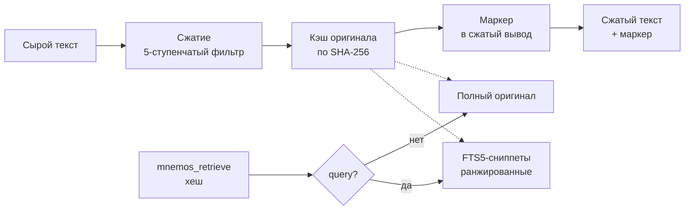

# Mnemos — Архитектура системы

**🌐 Language / Язык:** [English](../../en/architecture/overview.md) · Русский

## Обзор

Mnemos — гибридная система долговременной памяти: личная база знаний +
RAG-хранилище для AI-агентов. Основные поверхности доступа: CLI, HTTP API,
MCP-сервер и Obsidian-совместимый vault. Web UI запланирован как отдельный
проект (mnemos-eyes).

## Ключевые принципы

- **Markdown-first**: человеко-читаемые заметки в формате Obsidian (YAML frontmatter + markdown)
- **Семантический поиск**: vector embeddings поверх текстовых данных
- **Гибридный поиск**: full-text search + vector similarity, ранжирование по релевантности
- **Модульность**: ядро отделено от интерфейсов, каждый интерфейс — тонкий адаптер
- **Local-first**: всё работает локально, без обязательных облачных зависимостей
- **Расширяемость**: плагинная система для источников данных и интерфейсов

---

## Архитектура (слои)

```
┌─────────────────────────────────────────────────────────┐
│                    ИНТЕРФЕЙСЫ                            │
│  ┌─────┐  ┌──────────────────────┐  ┌──────┐  ┌─────┐  │
│  │ CLI │  │  Web UI              │  │ API  │  │ MCP │  │
│  │Typer│  │  (planned,           │  │ REST │  │ Srv │  │
│  │     │  │   mnemos-eyes)       │  │      │  │     │  │
│  └──┬──┘  └──────────┬───────────┘  └──┬───┘  └──┬──┘  │
│     │               │               │          │       │
├─────┴───────────────┴───────────────┴──────────┴───────┤
│                    FastAPI (Core API)                    │
│            GET/POST /memories, /search, /ingest         │
├─────────────────────────────────────────────────────────┤
│                    ЯДРО (brain_core)                     │
│  ┌──────────────┐ ┌──────────────┐ ┌──────────────────┐ │
│  │MemoryManager │ │ SearchEngine │ │IngestionPipeline │ │
│  │  CRUD ops    │ │ hybrid search│ │  parse & embed   │ │
│  └──────┬───────┘ └──────┬───────┘ └────────┬─────────┘ │
│         │                │                   │           │
├─────────┴────────────────┴───────────────────┴──────────┤
│                    ХРАНИЛИЩЕ                             │
│  ┌────────────────┐  ┌───────────────┐  ┌─────────────┐ │
│  │ Obsidian Vault │  │  ChromaDB     │  │  SQLite     │ │
│  │ (markdown)     │  │  (vectors)    │  │  (metadata) │ │
│  └────────────────┘  └───────────────┘  └─────────────┘ │
├─────────────────────────────────────────────────────────┤
│                    EMBEDDING                             │
│  sentence-transformers (local) / Ollama / OpenAI API    │
└─────────────────────────────────────────────────────────┘
```

---

## Компоненты

### 1. Хранилище (Storage Layer)

| Компонент | Назначение | Технология |
| --- | --- | --- |
| Obsidian Vault | Человеко-читаемые заметки, markdown + frontmatter | Файловая система |
| ChromaDB | Векторные эмбеддинги для семантического поиска | ChromaDB (persistent) |
| SQLite | Метаданные, теги, связи, история, кэш | SQLite + aiosqlite |

**Obsidian-совместимость**:
- Каждая «память» — markdown-файл с YAML frontmatter (tags, source, created, etc.)
- Поддержка `[[wiki-links]]` и тегов `#tag`
- Vault-директория настраивается в конфиге
- Файловый watcher отслеживает изменения и переиндексирует

### 2. Embedding Layer

- **По умолчанию**: `sentence-transformers/all-MiniLM-L6-v2` (быстро, ~80MB)
- **Для русского**: `intfloat/multilingual-e5-base` или `cointegrated/rubert-tiny2`
- **Опционально**: Ollama embeddings, OpenAI API
- Embedding-провайдер настраивается через конфиг
- Кэширование эмбеддингов для избежания повторных вычислений

### 3. Ядро (brain_core)

#### MemoryManager
- CRUD для записей памяти (create, read, update, delete)
- Автоматическая генерация эмбеддингов при создании/обновлении
- Синхронизация: markdown-файл ↔ ChromaDB ↔ SQLite
- Теги, категории, приоритеты, TTL (время жизни записи)

#### SearchEngine
- **Семантический поиск**: vector similarity через ChromaDB
- **Полнотекстовый поиск**: FTS5 через SQLite
- **Гибридный поиск**: RRF (Reciprocal Rank Fusion) для объединения результатов
- Фильтрация по тегам, датам, источникам, типам

#### IngestionPipeline
- Парсинг входящих данных из разных источников
- Чанкинг длинных документов (RecursiveCharacterTextSplitter)
- Дедупликация (по хешу контента + cosine similarity)
- Автоматическое извлечение тегов и метаданных

### Обратимое сжатие (CCR)

CCR (Compress-Cache-Retrieve) снижает токен-стоимость большого контента (вывод инструментов, логи, JSON) без потери данных. Переиспользует существующий 5-ступенчатый контекстный фильтр для сжатия и существующее SQLite-хранилище для кэширования — отдельной БД и отдельного бэкапа нет.

#### Конвейер



1. **Сжатие** — `apply_filter` запускает 5-ступенчатый конвейер (профильный: `log`, `terminal`, `code`, `docs`, `web`, `default`). Даёт 86–96% сокращения на логах и JSON.
2. **Кэш** — оригинальный несжатый текст сохраняется в `ccr_cache` по SHA-256 хешу. Адресация по содержимому: повторное сжатие того же текста — no-op.
3. **Маркер** — короткий парсимый маркер добавляется в начало сжатого вывода:
   ```text
   [compressed: <хеш> | <N>→<M> символов | retrieve via mnemos_retrieve]
   ```
4. **Извлечение** — `mnemos_retrieve(hash)` возвращает полный оригинал (без потери данных). `mnemos_retrieve(hash, query=...)` возвращает FTS5-ранжированные сниппеты внутри кэшированного оригинала.

#### Интеграция с хранилищем

Таблица `ccr_cache` находится в той же базе SQLite, что и `memories`:

| Таблица | Назначение | Ключ |
|---------|------------|------|
| `ccr_cache` | Оригинальный несжатый контент | `hash` (SHA-256, PRIMARY KEY) |
| `ccr_cache_fts` | FTS5 external-content индекс над `ccr_cache.original` | `rowid` |

FTS5 синхронизируется триггерами `AFTER INSERT/DELETE/UPDATE` — синхронизационного кода на уровне приложения нет. Извлечение сниппетов использует тот же движок FTS5, что и поиск по памяти, ограниченный одним кэшированным оригиналом по `hash`.

#### Вытеснение

| Механизм | По умолчанию | Когда запускается |
|----------|--------------|-------------------|
| Истечение TTL | 7 дней | Явный `ccr_cleanup()` (CLI / планировщик) |
| LRU-вытеснение | 10000 записей | Оппортунистически, при каждом вызове `compress` |

Очистка по TTL не запускается при каждом вызове compress (избегаем стоимости сканирования); вызывайте через CLI или планировщик.

#### Конфигурация

```yaml
ccr:
  enabled: true            # главный переключатель
  ttl_days: 7             # время жизни записи кэша
  max_entries: 10000      # порог LRU-вытеснения
  min_size_chars: 500     # ниже этого контент возвращается как есть
  snippet_count: 5        # сниппетов в retrieve(query=...)
  filter_budget: 4096     # токен-бюджет для apply_filter
```

Контент ниже `min_size_chars` возвращается как есть с `cached=false` и `reduction_pct=0` — мелкий контент не даёт экономии токенов.

---

### 4. Источники данных (Ingestors)

| Источник | Метод | Формат |
| --- | --- | --- |
| Ручной ввод | CLI / API | Текст / markdown |
| Obsidian vault | File watcher (watchdog) | Markdown + frontmatter |
| Веб-страницы | URL → trafilatura/BeautifulSoup | HTML → чистый текст |
| Файлы | Загрузка через API | PDF, TXT, MD, DOCX |
| LLM-чаты | MCP / экспорт | Диалоги |

### 5. Интерфейсы

#### CLI (Typer)
```bash
mnemos add "Заметка о важном" --tags project:mnemos agent:user gcw:learning   # быстрое добавление
mnemos add --file ./document.pdf --tags project:mnemos agent:user gcw:learning              # из файла
mnemos add --url https://example.com --tags project:research agent:user gcw:learning        # ингест URL
mnemos search "как настроить nginx"               # гибридный поиск (FTS5 + vector + RRF)
mnemos search "CVE" --project mnemos --limit 20    # поиск в пределах проекта
mnemos recall --agent tech-writer --limit 20       # последние записи агента (M3)
mnemos stats                                       # статистика хранилища
mnemos serve                                       # запуск HTTP API
mnemos mcp-server                                  # запуск MCP-сервера (stdio)
```

#### REST API (FastAPI)
```
POST   /api/v1/memories          — создать запись
GET    /api/v1/memories           — список (с пагинацией)
GET    /api/v1/memories/{id}      — получить запись
PUT    /api/v1/memories/{id}      — обновить
DELETE /api/v1/memories/{id}      — удалить
POST   /api/v1/search             — гибридный поиск
POST   /api/v1/ingest             — загрузка/парсинг
GET    /api/v1/tags               — список тегов
POST   /api/v1/sync               — переиндексация
GET    /api/v1/health              — healthcheck
```

#### MCP-сервер
Инструменты для Copilot/LLM-агентов:
- `brain_search` — семантический поиск по памяти
- `brain_add` — добавить новую запись
- `brain_get` — получить запись по ID
- `brain_list_tags` — список тегов
- `brain_ingest_url` — загрузить веб-страницу

#### Web UI (запланирован — mnemos-eyes)

Отдельный фронтенд-проект. Статус: в разработке. Функциональность:
- Dashboard: статистика, последние записи, облако тегов
- Поиск с фильтрами
- Редактор заметок

---

## Структура данных

### Memory (запись памяти)

```python
class Memory:
    id: str              # UUID
    content: str         # основной текст
    title: str | None    # заголовок (авто или ручной)
    tags: list[str]      # теги
    source: str          # источник: manual, web, file, mcp, obsidian
    source_url: str | None
    memory_type: str     # note, fact, snippet, bookmark, conversation
    created_at: datetime
    updated_at: datetime
    embedding: list[float] | None
    metadata: dict       # дополнительные данные
    file_path: str | None  # путь к markdown-файлу в vault
```

### Markdown-файл (Obsidian)

```markdown
---
id: 550e8400-e29b-41d4-a716-446655440000
title: Настройка nginx reverse proxy
tags: [nginx, devops, linux]
source: web
source_url: https://example.com/nginx-guide
memory_type: note
created: 2026-04-10T12:00:00
updated: 2026-04-10T12:00:00
---

# Настройка nginx reverse proxy

Основной контент заметки...
```

---

## Конфигурация

```yaml
# config.yaml
mnemos:
  vault_path: ~/.mnemos/vault          # Obsidian vault
  data_dir: ~/.mnemos/data             # ChromaDB + SQLite

embedding:
  provider: sentence-transformers    # sentence-transformers | ollama | openai
  model: intfloat/multilingual-e5-base
  # ollama_url: http://localhost:11434
  # openai_api_key: ...

search:
  default_limit: 20
  hybrid_alpha: 0.7                  # вес семантического поиска (0=FTS, 1=vector)

api:
  host: 0.0.0.0
  port: 8787

mcp:
  transport: stdio                   # stdio | sse
```

---

## Путь развития

### Фаза 1 — MVP ✦ (текущая)
- [x] Архитектура и модели данных
- [ ] Core: MemoryManager + ChromaDB + SQLite
- [ ] Embedding layer (sentence-transformers)
- [ ] Гибридный поиск
- [ ] CLI (add, search, list, tags)
- [ ] Obsidian vault sync (read/write)
- [ ] REST API (FastAPI)

### Фаза 2 — Интеграции
- [ ] MCP-сервер для Copilot
- [ ] Web scraping (ingest URLs)
- [ ] PDF/DOCX парсинг

### Фаза 3 — Продвинутые фичи
- [ ] Web UI (mnemos-eyes)
- [ ] Автокатегоризация (LLM-powered)
- [ ] Граф связей между записями
- [ ] Автосаммаризация длинных документов
- [ ] Периодическая консолидация (merge похожих записей)
- [ ] Экспорт/импорт

### Фаза 4 — Масштабирование
- [ ] Миграция на PostgreSQL + pgvector (опционально)
- [ ] Multi-user support
- [ ] Шифрование хранилища
